# Постановка задачі

Завдання модуля 1 — розробити програмну систему **типу 2**: клієнт для взаємодії з віддаленою папкою з файлами, полегшену версію Google Drive. Система отримала робочу назву **MiniDrive**.

Загальні вимоги до системи типу 2:

- авторизація на віддаленому сервері, після якої користувач опиняється у власному просторі-кабінеті (віртуальному диску);
- перегляд наявних файлів та їх атрибутів: назва, дата і час створення, дата і час зміни, ім'я того, хто завантажив, ім'я того, хто редагував;
- відображення або приховування всіх стовпців, крім стовпця з іменем;
- завантаження файлів на сервер, вивантаження та видалення файлів;
- синхронізація обраної папки на локальному диску з віддаленою;
- додаткові операції та типи файлів згідно з варіантом.

Варіант визначається двома останніми цифрами студентського квитка — **46**:

| Цифра | Список | Значення для проєкту |
|---|---|---|
| 4 | ТИПИ файлів, вміст яких показується при кліку | `.cs` — як текст, `.jpg` — як зображення |
| 6 | ОПЕРАЦІЇ | сортування за назвою (зростання і спадання); фільтр «усі файли» / «лише `.cpp`» / «лише `.png`» |

Етапи виконання та оцінювання: етап 1 — UML-специфікація (2 б.); етап 2 — десктоп-версія з unit-тестами та звітом (13 б.); етап 3 — веб-орієнтована версія (13 б.); етап 4 — порівняльний аналіз (2 б.). Бонуси: drag-and-drop при за/вивантаженні (+5 б.) та публікація серверної частини в інтернеті (+5 б.). Обидва бонуси заплановано.

**Нюанс варіанта.** Типи для перегляду (`.cs`, `.jpg`) і типи для фільтра (`.cpp`, `.png`) не збігаються, оскільки цифри варіанта незалежні. Прийнято проєктне рішення: перегляд реалізується узагальнено — будь-який текстовий файл (`.cs`, `.cpp`, `.txt`, `.md`, `.json` тощо) показується як текст, будь-яке растрове зображення (`.jpg`, `.png`, `.gif`) — як картинка. Обов'язковими й перевіреними тестами випадками залишаються `.cs` та `.jpg`. Це рішення варто підтвердити з викладачем.

Метою етапу 1 є побудова UML-специфікації: діаграми прецедентів (1+), класів (2+, з-поміж них VOPC для прецедента варіанта), активності (1+), взаємодії (2+), станів (1+), компонентів (1+) і розгортання (1+).

# Аналіз вимог

## Дійові особи

Єдина дійова особа — **User** (користувач), особа з обліковим записом. Неавторизований відвідувач може лише зареєструватися або увійти. Сховище об'єктів (MinIO) і база даних (PostgreSQL) є внутрішніми компонентами системи, а не дійовими особами.

## Функціональні вимоги

| ID | Вимога | Прецеденти |
|---|---|---|
| R1 | Реєстрація та вхід на віддаленому сервері; після входу — особистий простір (віртуальний диск); адресу сервера можна змінити в десктоп-клієнті | UC1, UC2, UC3, UC15, UC17 |
| R2 | Перегляд файлів з атрибутами: назва, дата створення, дата зміни, хто завантажив, хто редагував (додатково — розмір і тип); список оновлюється вручну | UC4, UC16 |
| R3 | Показ / приховування будь-якого стовпця, крім назви (шість перемикачів: дата створення, дата зміни, хто завантажив, хто редагував, розмір, тип) | UC7 |
| R4 | Сортування за назвою за зростанням і спаданням (операція варіанта) | UC5 |
| R5 | Фільтр: усі файли / лише `.cpp` / лише `.png` (операція варіанта) | UC6 |
| R6 | Клік по файлу показує вміст: `.cs` як текст, `.jpg` як зображення (тип варіанта) | UC8 |
| R7 | Завантаження файлу (нового або нової версії наявного), скачування, видалення | UC9, UC10, UC11, UC12 |
| R8 | Синхронізація обраної локальної папки з віддаленим простором: перемагає новіша версія, видалення не поширюються | UC13, UC14 |
| R9 | Бонус: drag-and-drop при завантаженні (обидва клієнти) та скачуванні (перетягування з вікна десктоп-клієнта) | UC9b, UC11a |

## Нефункціональні вимоги

- **Безпека**: паролі зберігаються як bcrypt-хеші; сесія — JWT (HS256, 24 год) у заголовку `Authorization: Bearer`; кожен користувач бачить лише файли свого простору.
- **Обмеження**: розмір файлу до 50 МБ — перевіряється двічі: на клієнті (`splitBySize`, `MAX_UPLOAD_MB`) і на сервері (`FileInterceptor limits`, `MAX_FILE_MB`); простір без підпапок (плоский список).
- **Переносимість**: десктоп-клієнт працює на macOS і Windows (Electron); веб-клієнт — у сучасних браузерах, синхронізація у вебі доступна в Chrome/Edge (File System Access API).
- **Розгортання**: сервер і сховище пакуються в Docker Compose і розгортаються як локально, так і на хмарній віртуальній машині.
- **Тестованість**: сортування, фільтр, вибір способу перегляду та план синхронізації — чисті функції у спільному пакеті, що покриваються unit-тестами без сервера.

## Глосарій

| Термін | Значення |
|---|---|
| Space | віртуальний диск — особистий простір користувача з файлами |
| FileEntry | метадані файлу: назва, розширення, розмір, дати створення/зміни, хто завантажив/редагував, ключ у сховищі |
| FileContent | вміст файлу як об'єкт у сховищі MinIO |
| FilePreview | абстракція перегляду; реалізації TextPreview (текст) та ImagePreview (зображення) |
| LocalFolder | прив'язана локальна папка на диску користувача |
| SyncPlan / SyncAction / SyncReport | план синхронізації (список дій upload / download / skip) та звіт про його виконання |
| SyncEngine | компонент десктоп-клієнта, який сканує папку, будує план і виконує його |

## Перелік прецедентів

| ID | Прецедент | Опис |
|---|---|---|
| UC1 | Sign up | реєстрація нового облікового запису |
| UC2 | Log in to the system | вхід; необхідний для всіх подальших дій |
| UC3 | Work with the file storage | кореневий прецедент роботи з кабінетом |
| UC4 | View the list of files and their attributes | перегляд таблиці файлів з атрибутами |
| UC5 | Sort by name | сортування за назвою: Ascending / Descending |
| UC6 | Filter by type | фільтр: All files / Only .cpp / Only .png |
| UC7 | Show / hide table columns | приховування стовпців (Creation date, Modification date, Uploaded by, Edited by, Size, File type) |
| UC8 | View the file contents | перегляд вмісту: .cs as text / .jpg as image |
| UC9 | Upload file(s) to the storage | завантаження файлів кнопкою (Select and upload) або перетягуванням (Drag-and-drop) |
| UC10 | Update a file (new version) | завантаження нової версії наявного файлу; оновлює дату зміни і поле «хто редагував» |
| UC11 | Download file(s) | скачування; у десктоп-клієнті також перетягуванням з вікна (Drag out of the window) |
| UC12 | Delete file(s) | видалення файлу з простору |
| UC13 | Bind / change local folder | прив'язка або зміна локальної папки для синхронізації |
| UC14 | Synchronize with the local folder | синхронізація з прив'язаною папкою; автоматичне відстеження змін (десктоп); перемагає новіша версія, видалення не поширюються |
| UC15 | Log out from the system | вихід із системи |
| UC16 | Refresh the list | ручне оновлення списку файлів кнопкою «Оновити» |
| UC17 | Change the API server address | зміна адреси сервера на екрані входу (лише десктоп-клієнт) |

# Високорівневе проєктування

## Архітектура

Система складається з трьох застосунків і двох спільних пакетів в одному монорепозиторії (TypeScript):

- **apps/api** — REST-сервер на NestJS: модулі `AuthModule`, `UsersModule`, `FilesModule`, `StorageModule`, `PrismaModule`; метадані у PostgreSQL (через Prisma), вміст файлів — у сховищі MinIO через S3-сумісний API.
- **apps/desktop** — десктоп-клієнт на Electron: головний процес (`SyncEngine`, `FolderWatcher`, `registerIpc`, `dragOutHandler`, `settings`), preload-міст і тонкий рендерер, який лише монтує спільні екрани.
- **apps/web** — веб-клієнт на Next.js: сторінки `/login` та `/drive`, `SessionStore` у `localStorage`, `BrowserSyncEngine` на File System Access API.
- **packages/shared** — типи DTO, ієрархія `FilePreview`, `DriveViewModel`, `ApiClient` та модулі чистих функцій: `fileList` (`sortByName`, `filterByType`), `columns` (`toggleColumn`), `preview` (`previewKindOf`, `createPreview`), `sync` (`computeSyncPlan`, `runSyncPlan`), `syncLedger`, `limits` (`splitBySize`).
- **packages/ui** — спільний React-шар обох клієнтів: `LoginForm`, `DriveWorkspace` (композиція семи елементів керування), `SyncPanel`, хук `useDrive` та реєстр `apiRegistry`.

Обидва клієнти працюють з одним і тим самим REST API і рендерять ті самі екрани з `packages/ui`; відрізняються лише платформні зворотні виклики (Electron IPC у десктопі, File System Access API у браузері). Сортування, фільтрація, видимість стовпців і план синхронізації обчислюються на клієнті функціями `packages/shared`.

## REST API

| Метод | Шлях | Призначення |
|---|---|---|
| POST | `/auth/register` | реєстрація, повертає `AuthResponseDto {accessToken, user}` |
| POST | `/auth/login` | вхід, повертає `AuthResponseDto` |
| GET | `/auth/me` | поточний користувач |
| GET | `/files` | список `FileDto[]` простору користувача |
| POST | `/files` | завантаження (multipart); наявна назва — перезапис (нова версія) |
| GET | `/files/:id/content` | вміст файлу (перегляд і скачування) |
| DELETE | `/files/:id` | видалення |
| GET | `/health` | проба стану сервера |
| GET | `/docs` | Swagger-документація (вимикається змінною `SWAGGER_ENABLED`) |

## Рис. 1. Діаграма компонентів

{width=16cm}

**Пояснення.** Діаграма показує три підсистеми поверх спільного API та два спільні пакети зліва. Десктоп-клієнт (Electron) складається з компонентів `Main process`, `Preload bridge` та `Renderer UI (React)`, з'єднаних через IPC (contextBridge); головний процес працює з прив'язаною локальною папкою через Node fs / chokidar. Веб-клієнт (Next.js) містить сторінки `/login` і `/drive` та `BrowserSyncEngine`. UI-компоненти не належать жодному з клієнтів: `LoginForm`, `DriveWorkspace`, `SyncPanel`, `FileTable`, `PreviewPanel`, `UploadDropzone`, `SortControl`, `FilterControl`, `ColumnToggle`, `apiRegistry` і хук `useDrive` зібрані в пакеті `@minidrive/ui`, який обидва клієнти імпортують поряд із `@minidrive/shared`. Клієнти споживають інтерфейс `REST API (/auth, /files, /health, /docs)` по HTTPS/JSON, який надає сервер NestJS з модулями `AuthModule`, `UsersModule`, `FilesModule`, `StorageModule`, `PrismaModule`; примітка нагадує, що в хмарі звернення йдуть через зворотний проксі `caddy`, а сам веб-застосунок віддає окремий контейнер `web`. Сервер, своєю чергою, використовує інтерфейси `SQL (Prisma)` бази PostgreSQL та `S3 API` сховища MinIO. Діаграма фіксує межу перевикористання коду: екрани і логіка списку файлів спільні, оболонка та доступ до файлової системи — окремі для кожного клієнта.

## Рис. 2. Діаграма розгортання

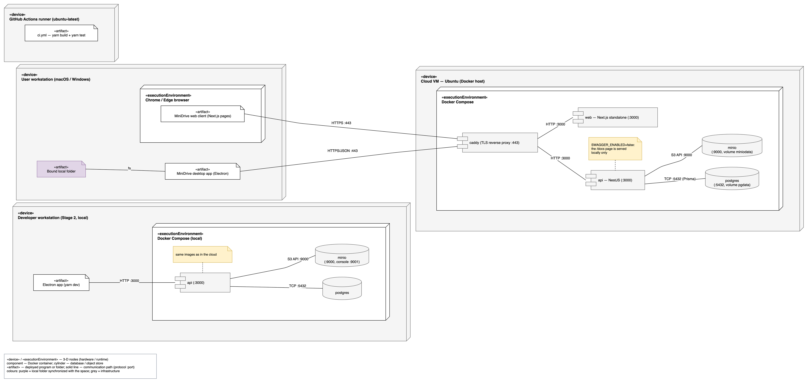{width=16cm}

**Пояснення.** Показано чотири вузли-пристрої. На робочій станції користувача розгорнуто артефакт «MiniDrive desktop app (Electron)», прив'язану локальну папку та браузер Chrome/Edge з веб-клієнтом. На хмарній віртуальній машині (Ubuntu, хост Docker) у середовищі виконання Docker Compose працюють контейнери `caddy` (TLS-проксі, порт 443), `api` (NestJS, порт 3000), `web` (Next.js standalone, порт 3000), `postgres` (порт 5432, том `pgdata`) і `minio` (порт 9000, том `miniodata`); `caddy` проксіює `/api/*` на `api:3000`, а решту — на `web:3000`. Примітка біля контейнера `api` фіксує, що в хмарі `SWAGGER_ENABLED=false`, тобто сторінка `/docs` доступна лише локально. Клієнти звертаються до сервера по HTTPS через `caddy`. Окремо показано робочу станцію розробника для етапу 2: той самий Docker Compose локально (`api`, `postgres`, `minio` з веб-консоллю на порту 9001) та Electron-застосунок у режимі розробки; примітка підкреслює, що використовуються ті самі образи, що й у хмарі. Четвертий вузол — раннер GitHub Actions, на якому робочий процес `ci.yml` виконує `yarn build` і `yarn test` на кожен push і pull request.

# Деталізоване проєктування

## Рис. 3. Діаграма прецедентів

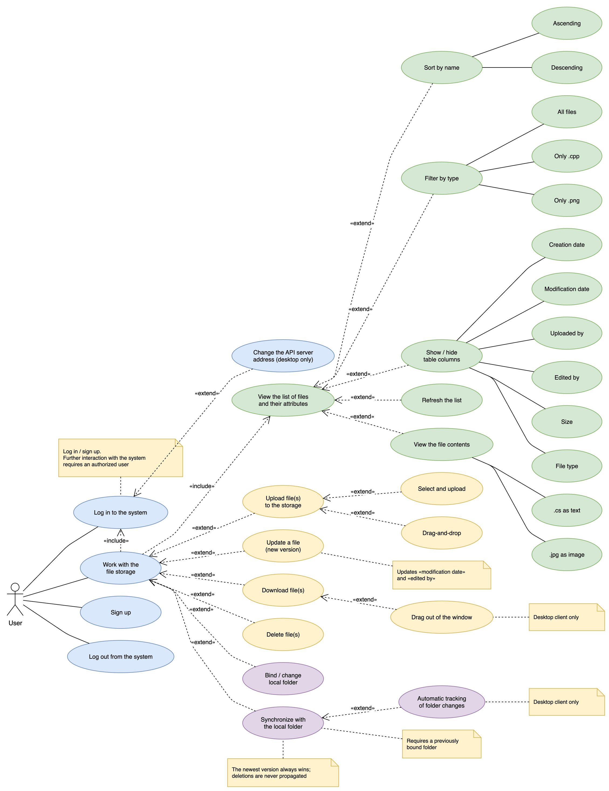{width=15cm}

**Пояснення.** Діаграма побудована каскадом: дійова особа User пов'язана з кореневими прецедентами `Sign up`, `Log in to the system`, `Log out from the system` та `Work with the file storage`. Кореневий прецедент роботи зі сховищем через `«include»` вимагає входу в систему та перегляду списку файлів (`View the list of files and their attributes`). Від перегляду списку через `«extend»` відгалужуються операції варіанта — `Sort by name` з параметрами Ascending / Descending та `Filter by type` з параметрами All files / Only .cpp / Only .png, — а також `Show / hide table columns` (Creation date, Modification date, Uploaded by, Edited by, Size, File type), `Refresh the list` і `View the file contents` (.cs as text, .jpg as image). Від прецедента входу відгалужується `Change the API server address` — екран входу десктоп-клієнта дозволяє вказати іншу адресу сервера. Від кореня відгалужуються операції над файлами: `Upload file(s) to the storage` з підваріантами Select and upload та Drag-and-drop, `Update a file (new version)`, `Download file(s)` з підваріантом Drag out of the window, `Delete file(s)`, а також гілка синхронізації: `Bind / change local folder` та `Synchronize with the local folder` з розширенням Automatic tracking of folder changes. Прецедента «розв'язання конфліктів версій» немає: система ніколи не питає користувача, яку версію лишити, — за правилом §4.2 перемагає новіша сторона, а видалення не поширюються; це зафіксовано приміткою під прецедентом синхронізації. Інші примітки фіксують передумову авторизації, побічний ефект оновлення файлу (зміна дати та поля «хто редагував»), передумову прив'язаної папки та обмеження «лише десктоп-клієнт» для перетягування з вікна й автоматичного відстеження.

## Рис. 4. Діаграма класів — доменна модель

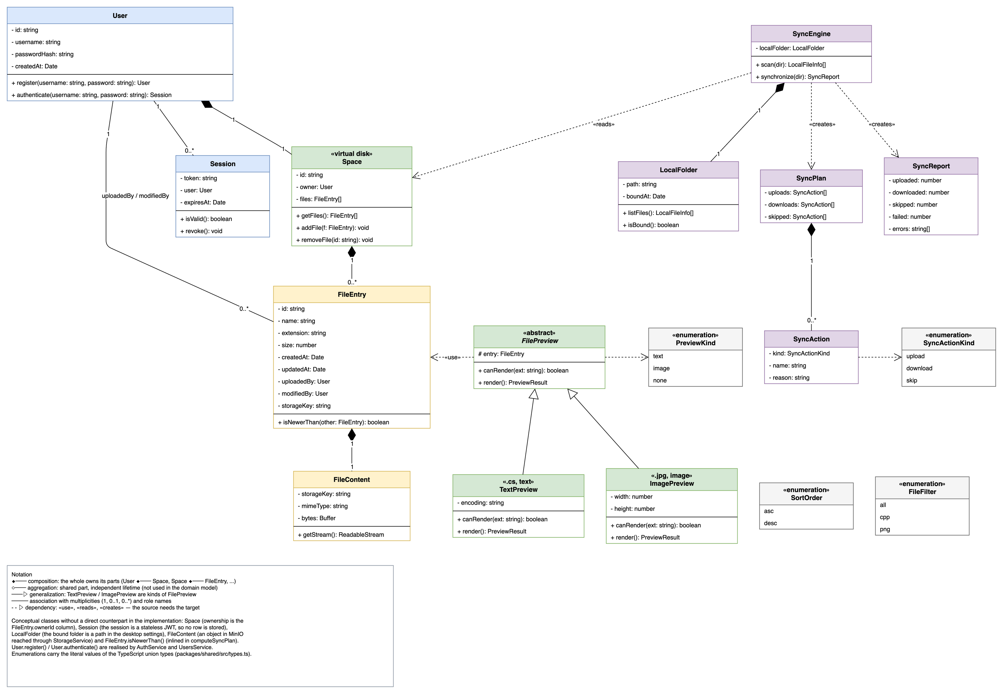{width=16cm}

**Пояснення.** Доменна модель описує предметну область без прив'язки до фреймворків. `User` володіє одним простором `Space` («virtual disk»), який є композицією записів `FileEntry`; кожен запис має рівно один `FileContent` — об'єкт у сховищі. Асоціація `FileEntry` — `User` з ролями `uploadedBy / modifiedBy` є джерелом атрибутів «хто завантажив» і «хто редагував». `Session` моделює JWT-сесію користувача (`token`, `expiresAt`, `isValid()`). Ієрархія перегляду: абстрактний `FilePreview` з операціями `canRender(ext)` та `render()` і два нащадки — `TextPreview` («.cs, text») та `ImagePreview` («.jpg, image»), що безпосередньо відбиває типи варіанта. Гілка синхронізації: `SyncEngine` володіє `LocalFolder`, читає `Space`, а план `SyncPlan` із дій `SyncAction` (`kind: upload | download | skip`) і звіт `SyncReport` створює під час виконання (залежності «creates»). Перелічення `SortOrder {asc, desc}` та `FileFilter {all, cpp, png}` кодують операції варіанта і містять ті самі літерали, що й типи-об'єднання TypeScript. Легенда пояснює позначення композиції, узагальнення, асоціації та залежності, а також перелічує аналітичні поняття, які не мають прямого відповідника в коді: `Space` (володіння задає колонка `FileEntry.ownerId`), `Session` (сесія — це JWT без стану), `LocalFolder` (шлях у налаштуваннях десктопа), `FileContent` (об'єкт у MinIO) та `FileEntry.isNewerThan()` (вбудовано в `computeSyncPlan`); операції `User.register()` і `User.authenticate()` реалізують `AuthService` і `UsersService`.

## Рис. 5. VOPC-діаграма прецедента «Sort by name» + «Filter by type»

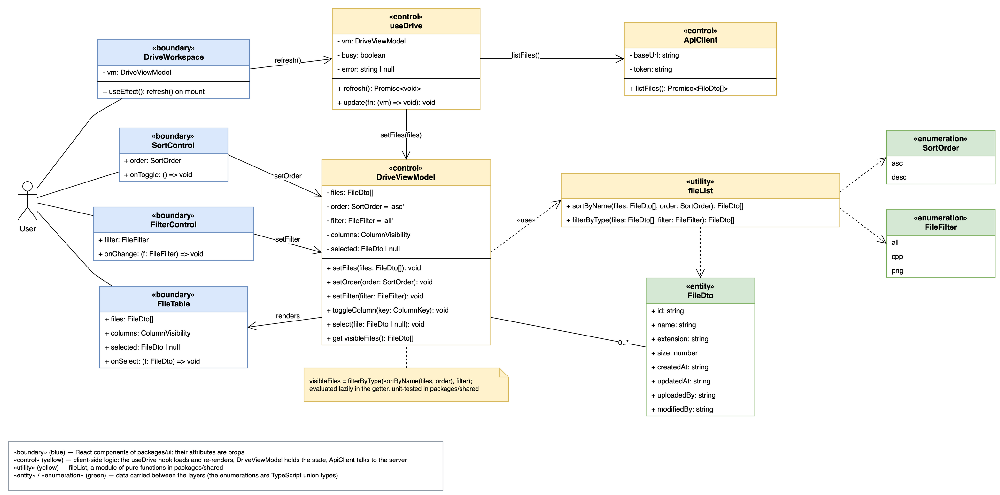{width=16cm}

**Пояснення.** Діаграма класів, що беруть участь у прецеденті (View Of Participating Classes), побудована за методологією RUP зі стереотипами трьох ролей. Граничні класи `«boundary»` — це React-компоненти пакета `packages/ui`, тому їхні «атрибути» є пропсами: `SortControl` (`order`, `onToggle`), `FilterControl` (`filter`, `onChange`), `FileTable` (`files`, `columns`, `selected`, `onSelect`) і `DriveWorkspace`, який їх монтує. Завантаження списку належить не моделі подання, а хуку `«control» useDrive`: він викликає `«control» ApiClient.listFiles()`, обробляє відповідь 401 і передає результат у `DriveViewModel.setFiles(files)`. Керівний клас `«control» DriveViewModel` зберігає `files`, `order: SortOrder = 'asc'`, `filter: FileFilter = 'all'`, `columns` і `selected`, приймає команди від граничних класів (`setOrder`, `setFilter`, `toggleColumn`, `select`) та обчислює похідну властивість `visibleFiles`. Саме обчислення делеговано модулю `«utility» fileList` з чистими функціями `sortByName(files, order)` і `filterByType(files, filter)` — це модуль вільних функцій, а не утилітний клас. Сутнісні класи `«entity»` — `FileDto` (де `createdAt` і `updatedAt` є рядками ISO) і перелічення `SortOrder {asc, desc}`, `FileFilter {all, cpp, png}` — є пасивними даними, які передаються між шарами. Примітка фіксує формулу `visibleFiles = filterByType(sortByName(files, order), filter)`: вона обчислюється лениво в геттері, обидві операції варіанта виконуються на клієнті та покриваються unit-тестами спільного пакета.

## Рис. 6. Діаграма класів — сервер (NestJS)

{width=16cm}

**Пояснення.** Класи сервера згруповано за модулями NestJS. `AuthModule` містить `AuthController` (`register`, `login`, `me`), `AuthService` (`register(dto)`, `login(dto)`, `validateUser`, приватний `issue(user)`, який підписує JWT), `JwtStrategy` з `validate(payload): JwtUser`, охоронець `JwtAuthGuard` і параметр-декоратор `CurrentUser`; `UsersModule` — `UsersService` (`findByUsername`, `findById`, `create(username, password)`, який хешує пароль усередині, `hash`, `verify`); `FilesModule` — `FilesController` (`list`, `upload`, `download`, `remove`) і `FilesService` з операцією `upsert(owner, file)`, яка реалізує перезапис файлу з наявною назвою, та приватними `findOwned` і `toDto`; `StorageModule` — `StorageService` з фабрикою `fromEnv()`, `onModuleInit()` (створює бакет) та операціями `putObject`, `getObject`, `deleteObject` над MinIO; `PrismaModule` — `PrismaService`, що розширює `PrismaClient` (`onModuleInit`, `onModuleDestroy`). Пакет `AppModule / bootstrap` містить `HealthController` (`GET /health`) і типізоване середовище `AppConfig`, яке `loadConfig(env)` збирає зі змінних оточення: звідти `StorageService` бере параметри S3, `FilesController` — `maxFileBytes`, а `main.ts` — прапорець `swaggerEnabled`. Окремо показано DTO (`RegisterDto`, `LoginDto`, `UserDto`, `AuthResponseDto`, `FileDto`, де `createdAt` і `updatedAt` серіалізуються як рядки ISO) та сутності Prisma `User` і `FileEntry` з асоціацією «owner» 1 — 0..*. Залежності «uses» / «guard» / «maps» показують, як контролери спираються на сервіси, а сервіси — на сховище та базу даних.

## Рис. 7. Діаграма класів — спільний пакет і клієнти

{width=16cm}

**Пояснення.** Діаграма показує чотири пакети. `packages/shared` містить типи (`FileDto` з рядковими `createdAt` / `updatedAt`, `ColumnVisibility`, `LocalFileInfo` з `mtime: number`, `SyncAction`, `SyncPlan`, `SyncReport`), клас `DriveViewModel`, клієнт `ApiClient` і модулі вільних функцій — `fileList`, `columns`, `limits`, `preview` (звідки походить `createPreview(entry)`), `sync` (`SKEW_MS`, `computeSyncPlan`, `runSyncPlan`, `emptySyncReport`, `failedSyncReport`) та `syncLedger`; утилітних класів і фабрик у коді немає, тому вони позначені стереотипом «module». `packages/ui` — спільний React-шар: `LoginForm`, `DriveWorkspace`, який композицією тримає сім елементів керування (`UploadDropzone`, `SortControl`, `FilterControl`, `ColumnToggle`, `FileTable`, `PreviewPanel`), `SyncPanel`, хук `useDrive` і реєстр `apiRegistry`. `apps/web` складається зі сторінок `LoginPage` та `DrivePage`, які лише монтують спільні екрани, а також `SessionStore` (токен у localStorage), `BrowserSyncEngine` (конструктор приймає `api` і `ledgers`, каталог передається параметром) і `localLedgerStore`. `apps/desktop` поділено на три частини: рендерер (`App`, обгортка `SyncPanel`, `SessionStore` через IPC), preload (`PreloadBridge`) і головний процес (`createWindow`, `registerIpc`, `settings`, `dragOutHandler`, `LocalFolderScanner`, `SyncEngine`, `FolderWatcher` з `start` / `stop` / `pause` / `resume`). Залежності «use» показують, що обидва клієнти спираються на спільні пакети, а ланцюжок Renderer → PreloadBridge → registerIpc → SyncEngine ілюструє, як команда синхронізації з інтерфейсу досягає файлової системи.

## Рис. 8. Діаграма активності — синхронізація з локальною папкою (UC14)

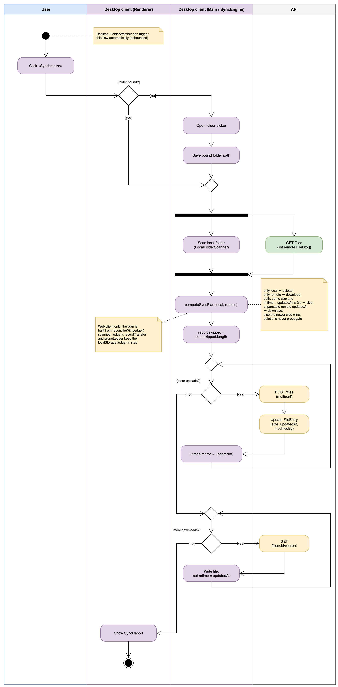{width=12cm}

**Пояснення.** Доріжки відповідають користувачеві, рендереру та головному процесу десктоп-клієнта і серверу. Після натискання «Synchronize» перевіряється, чи прив'язано папку; якщо ні — відкривається діалог вибору, і шлях зберігається. Далі паралельно (вилка/злиття) виконуються сканування локальної папки (`LocalFolderScanner`) і запит `GET /files`. За обома списками обчислюється план `computeSyncPlan(local, remote)` за правилами з примітки: файл лише локально — завантажити; лише віддалено — скачати; в обох місцях з однаковим розміром і різницею часу зміни до 2 с — пропустити; нерозбірна віддалена мітка часу — скачати; інакше перемагає новіша сторона; видалення ніколи не поширюються. План не показується користувачеві: панель під час виконання відображає смужку прогресу, а після завершення — звіт. Пропущені файли зараховуються один раз (`report.skipped = plan.skipped.length`), після чого `runSyncPlan` виконує два послідовні цикли: спочатку всі завантаження (`POST /files` з оновленням `size`, `updatedAt`, `modifiedBy`, потім `utimes(mtime = updatedAt)` для локального файлу), далі всі скачування (`GET /files/:id/content` із записом файлу та встановленням mtime). Після обох циклів показується `SyncReport`. Примітка на старті вказує, що `FolderWatcher` може запускати цей потік автоматично, а друга примітка — що у веб-клієнті план будується з `reconcileWithLedger(scanned, ledger)`, а `recordTransfer` і `pruneLedger` підтримують журнал у localStorage.

## Рис. 9. Діаграма активності — завантаження та оновлення файлу (UC9, UC10)

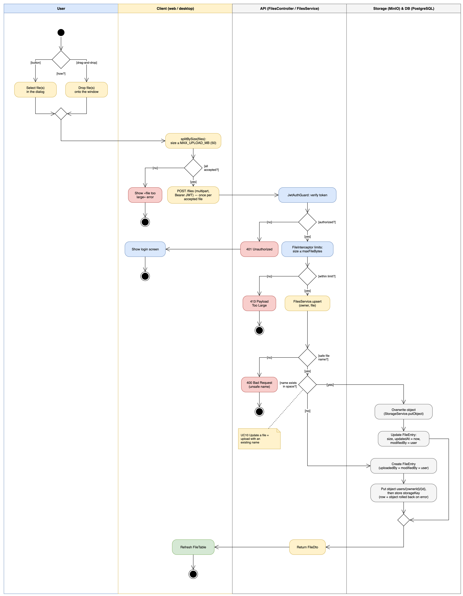{width=14cm}

**Пояснення.** Користувач обирає файли кнопкою або перетягує їх у вікно (бонус drag-and-drop); обидві гілки зливаються. Клієнт відсіює завеликі файли функцією `splitBySize` (`MAX_UPLOAD_MB` = 50) і показує помилку для відхилених, а кожен прийнятий файл надсилає окремим запитом `POST /files` з JWT. На сервері `JwtAuthGuard` перевіряє токен; у разі відмови повертається 401 і клієнт показує екран входу. Той самий ліміт перевіряється ще раз на сервері (`FileInterceptor limits`, `maxFileBytes`) — запит поза лімітом отримує 413, а небезпечне ім'я файлу відхиляється з кодом 400 ще до звернення до бази. Далі `FilesService.upsert(owner, file)` перевіряє, чи існує файл із такою назвою у просторі: якщо так — об'єкт перезаписується через `StorageService.putObject`, а в `FileEntry` оновлюються `size`, `updatedAt` і `modifiedBy` (це і є прецедент UC10 «Update a file»); якщо ні — створюється новий `FileEntry` з `uploadedBy = modifiedBy = user`, об'єкт кладеться за ключем `users/{ownerId}/{id}`, після чого записується `storageKey`; якщо запис об'єкта не вдався, і рядок, і об'єкт видаляються назад. Сервер повертає `FileDto`, клієнт оновлює таблицю.

## Рис. 10. Діаграма послідовності — реєстрація та вхід (UC1, UC2)

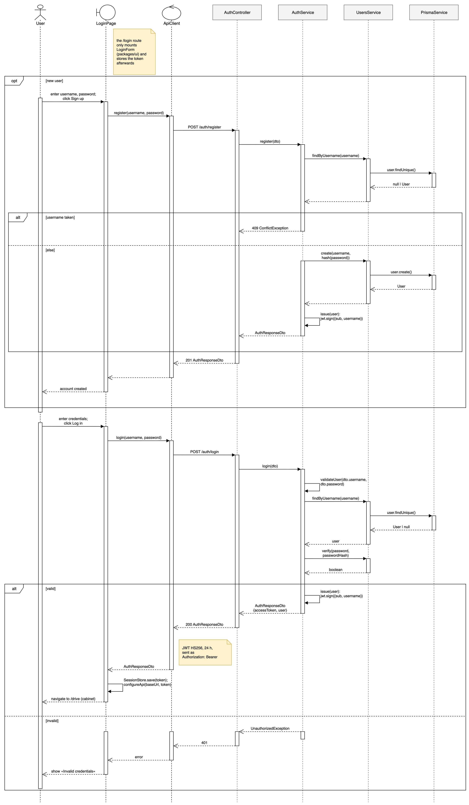{width=13cm}

**Пояснення.** У фрагменті `opt [new user]` користувач через граничний об'єкт `LoginPage` (маршрут `/login`, який лише монтує спільну форму `LoginForm` з `packages/ui`) і керівний `ApiClient` викликає `POST /auth/register`; `AuthController` передає запит до `AuthService`, який через `UsersService` і `PrismaService` перевіряє унікальність імені (`alt`: 409 ConflictException або створення користувача з хешем пароля і підписання JWT приватним методом `issue(user)` → `jwt.sign`). Далі показано вхід: `POST /auth/login` → `AuthService.login(dto)`, усередині якого викликається `validateUser(dto.username, dto.password)` — пошук користувача та перевірка пароля `verify(password, passwordHash)`; у гілці `[valid]` підписується JWT, відповідь `AuthResponseDto` повертається сторінці, і вже сторінка зберігає токен через `SessionStore.save(token)` та переналаштовує клієнт `configureApi(baseUrl, token)`, після чого переходить до кабінету `/drive`; у гілці `[invalid]` повертається 401 і показується повідомлення про невірні дані. Примітка вказує параметри токена (HS256, 24 год, заголовок Authorization: Bearer).

## Рис. 11. Діаграма послідовності — завантаження та перегляд вмісту (UC9, UC8)

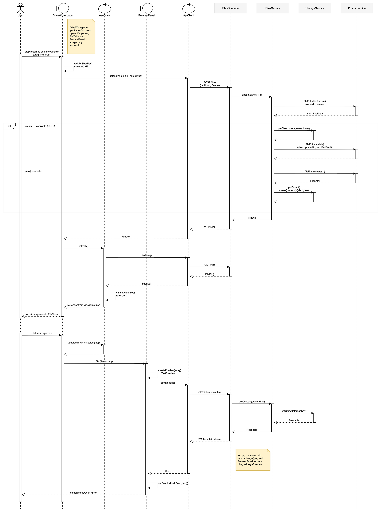{width=14cm}

**Пояснення.** Перша частина: користувач перетягує файл `report.cs` у вікно; `DriveWorkspace` перевіряє розмір (`splitBySize`) і звертається до `ApiClient` напряму — у моделі подання немає операції `upload()`; далі `POST /files`, і `FilesService.upsert` шукає запис за `{ownerId, name}`, а у фрагменті `alt` або перезаписує об'єкт та оновлює `FileEntry` (UC10), або створює запис і кладе об'єкт. Після відповіді `201 FileDto` `DriveWorkspace` викликає `refresh()` хука `useDrive`, той запитує `GET /files`, кладе результат у `DriveViewModel.setFiles(files)` і перемальовує таблицю з `vm.visibleFiles`. Друга частина: клік по рядку веде до `vm.select(file)` через `useDrive.update(...)`, після чого `DriveWorkspace` передає обраний файл пропсом у `PreviewPanel`; сама панель викликає `createPreview(entry)` — для `.cs` це `TextPreview` — і завантажує вміст через `GET /files/:id/content`, де сервер бере потік з `StorageService.getObject` і повертає `text/plain`; результат панель зберігає в `setResult(...)` і показує в `<pre>`. Примітка пояснює, що для `.jpg` той самий виклик повертає `image/jpeg`, а `ImagePreview` відображає зображення.

## Рис. 12. Діаграма послідовності — синхронізація (UC14)

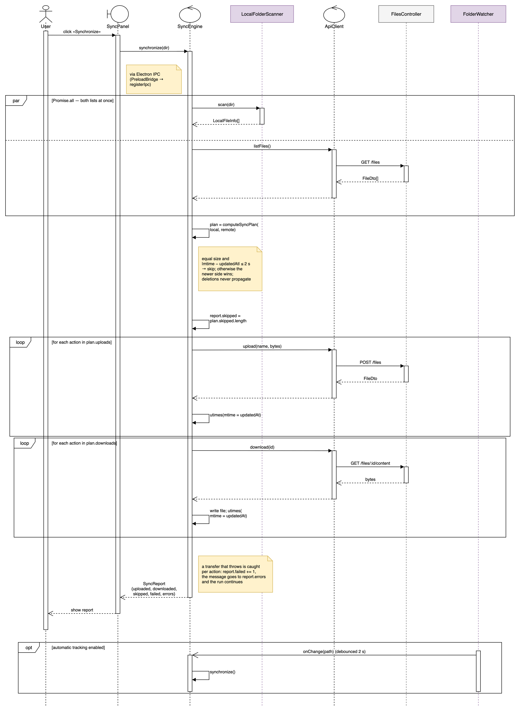{width=14cm}

**Пояснення.** `SyncPanel` через IPC викликає `SyncEngine.synchronize(dir)`. У фрагменті `par` рушій одночасно (через `Promise.all`) отримує `LocalFileInfo[]` від `LocalFolderScanner.scan(dir)` і `FileDto[]` через `ApiClient.listFiles()` → `GET /files`, після чого обчислює план (`computeSyncPlan`) і одразу зараховує пропущені файли (`report.skipped = plan.skipped.length`). Далі йдуть два послідовні фрагменти `loop`: перший — по `plan.uploads` (`upload(name, bytes)` → `POST /files`, потім `utimes(mtime = updatedAt)`), другий — по `plan.downloads` (`download(id)` → `GET /files/:id/content`, запис файлу та встановлення mtime). Окремої гілки для пропущених дій немає. Наприкінці повертається `SyncReport {uploaded, downloaded, skipped, failed, errors}`, який панель показує користувачеві; примітка уточнює, що помилка окремої передачі перехоплюється, збільшує `report.failed` і не перериває виконання. Фрагмент `opt [automatic tracking enabled]` демонструє, як `FolderWatcher` через дебаунс 2 с ініціює повторну синхронізацію (UC14a). Примітка біля планування формулює правило: однаковий розмір і різниця часу до 2 с — пропустити, інакше перемагає новіша сторона, а видалення не поширюються.

## Рис. 13. Діаграма комунікації — сортування та фільтрація (UC5, UC6)

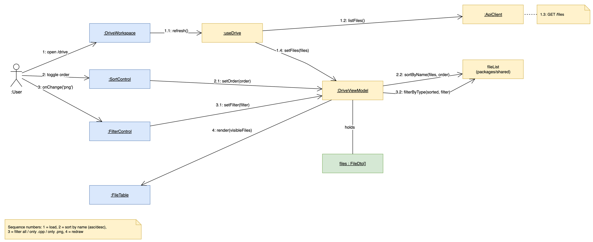{width=16cm}

**Пояснення.** Діаграма комунікації є другим поданням взаємодії, що відповідає VOPC (рис. 5), і використовує ті самі об'єкти: `:DriveWorkspace`, `:FileTable`, `:SortControl`, `:FilterControl`, `:useDrive`, `:DriveViewModel`, `:ApiClient`, модуль `fileList` та `files : FileDto[]`. Нумерація повідомлень задає порядок: 1 — відкриття кабінету `/drive` і 1.1 — `refresh()` на хуку `useDrive` (саме він, а не модель подання, завантажує список), 1.2–1.4 — отримання списку через `listFiles()` / `GET /files` і передача його в `setFiles(files)`; 2 — перемикання порядку на елементі сортування та 2.2 — `sortByName(files, order)`; 3 — `onChange('png')` на елементі фільтра та 3.2 — `filterByType(sorted, filter)`; 4 — `render(visibleFiles)`. Так на одній діаграмі видно обидві операції варіанта і те, що вони не потребують звернень до сервера.

## Рис. 14. Діаграма станів — сеанс клієнта

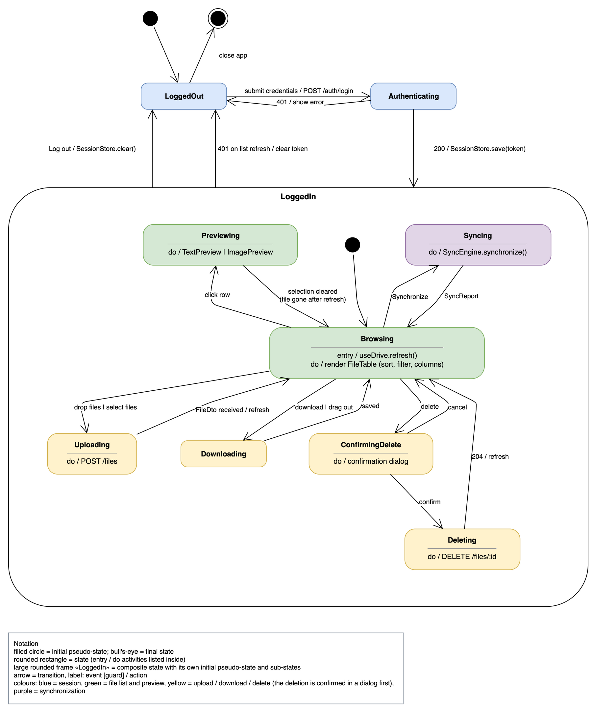{width=15cm}

**Пояснення.** Клієнт стартує в стані `LoggedOut`; подання облікових даних переводить його в `Authenticating` (`POST /auth/login`), звідки за 401 він повертається назад, а за 200 із збереженням токена (`SessionStore.save(token)`) входить у складений стан `LoggedIn`. Усередині стан `Browsing` (entry / `refresh()`, do / відображення таблиці з сортуванням, фільтром і стовпцями) є центральним: клік по рядку веде до `Previewing`, кидання або вибір файлів — до `Uploading` (`POST /files`), скачування чи перетягування з вікна — до `Downloading`, видалення — спершу до `ConfirmingDelete` (діалог підтвердження), звідки «cancel» повертає до `Browsing`, а «confirm» веде до `Deleting` (`DELETE /files/:id`), натискання «Synchronize» — до `Syncing`; кожен із цих станів після завершення повертає до `Browsing`. Окремої дії «закрити перегляд» немає: панель перегляду завжди змонтована поруч із таблицею, тому `Previewing` залишається лише тоді, коли вибір скидається (обраний файл зник після оновлення списку). Вихід із системи переводить клієнт у `LoggedOut`; те саме робить відповідь 401 на оновленні списку. Закриття застосунку — кінцевий стан.

## Рис. 15. Діаграма станів — життєвий цикл файлу під час синхронізації

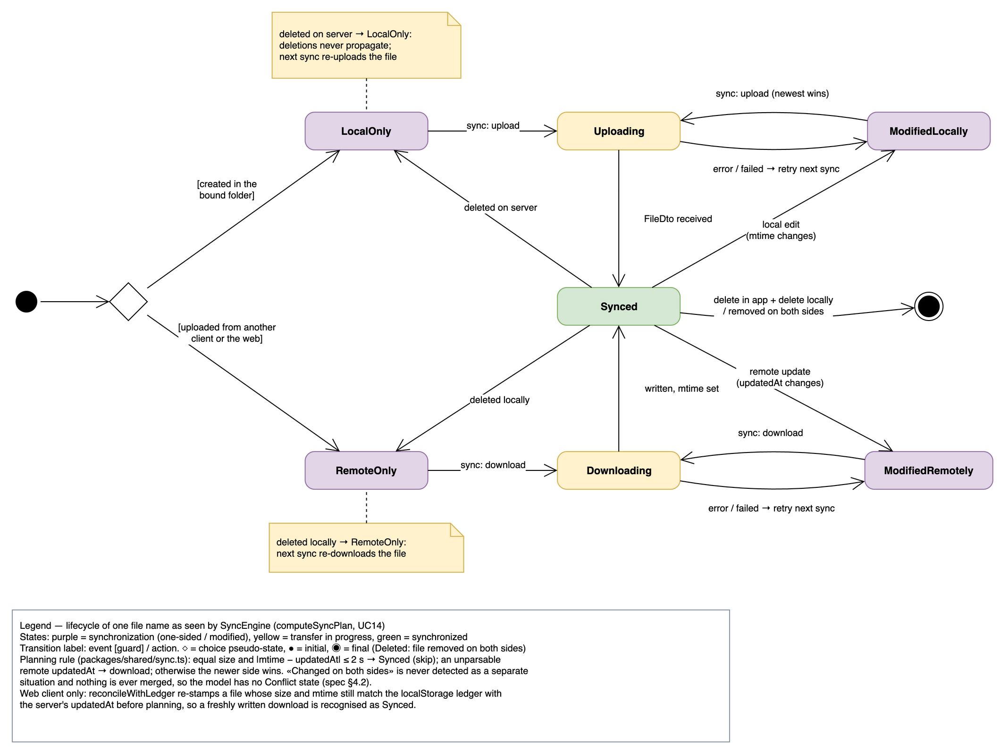{width=16cm}

**Пояснення.** Діаграма описує один файл (за назвою) очима `SyncEngine`. Файл з'являється або як `LocalOnly` (створений у прив'язаній папці), або як `RemoteOnly` (завантажений з іншого клієнта чи вебу); синхронізація переводить його через `Uploading` або `Downloading` у `Synced`. Локальна зміна (mtime) дає `ModifiedLocally`, віддалена (updatedAt) — `ModifiedRemotely`, і кожен із цих станів на наступному запуску просто передає новішу сторону. Стану `Conflict` у моделі немає: `computeSyncPlan` порівнює лише локальний `mtime` з віддаленим `updatedAt` для однієї назви і ніколи не виявляє «змінено з обох боків» як окрему ситуацію, тож нічого не зливається (§4.2). Помилка передачі повертає файл до відповідного «modified»-стану з повторною спробою на наступній синхронізації. Видалення на сервері переводить файл у `LocalOnly`, видалення локально — у `RemoteOnly`: видалення не поширюються, і наступна синхронізація відновлює файл на другій стороні. Кінцевий стан досягається лише після видалення з обох боків. Легенда додатково фіксує правило планування (однаковий розмір і різниця часу до 2 с — `Synced`; нерозбірний `updatedAt` — скачування) та особливість веб-клієнта, де `reconcileWithLedger` перед плануванням підставляє серверний `updatedAt` файлу, розмір і mtime якого збігаються з журналом у localStorage.

## Рис. 16. Діаграма станів — сеанс синхронізації (SyncEngine)

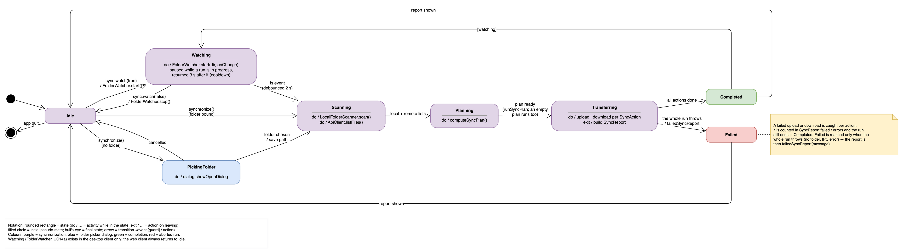{width=16cm}

**Пояснення.** `SyncEngine` перебуває в `Idle`. Виклик `synchronize()` без прив'язаної папки веде до `PickingFolder` (діалог вибору), з папкою — одразу до `Scanning` (do / `LocalFolderScanner.scan()`, `ApiClient.listFiles()`), далі до `Planning` (do / `computeSyncPlan()`) і завжди до `Transferring`: `runSyncPlan` викликається навіть для порожнього плану, тому окремої гілки «дій немає» немає. У `Transferring` виконуються завантаження і скачування для кожної `SyncAction`, а на виході будується `SyncReport`; за нормального завершення — `Completed`. Стан `Failed` досягається лише тоді, коли весь запуск завершується винятком (немає папки, помилка IPC) і повертається `failedSyncReport(message)`; окрема невдала передача натомість зараховується в `SyncReport.failed` та `errors`, і запуск усе одно доходить до `Completed` — це зафіксовано приміткою. В обох випадках після показу звіту — повернення в `Idle`. Стан `Watching` (do / `FolderWatcher.start(dir, onChange)`) існує лише в десктоп-клієнті: він вмикається викликом `sync.watch(true)` і вимикається `sync.watch(false)`; на час запуску спостерігач ставиться на паузу і відновлюється через 3 с після нього. Подія файлової системи з дебаунсом 2 с запускає `Scanning`, а після `Completed` при увімкненому відстеженні рушій повертається у `Watching`.

# Інструменти

Діаграми створено як нативні файли draw.io (`docs/uml/drawio/*.drawio`), які можна редагувати в застосунку draw.io або в VS Code. Файли генеруються Python-скриптами (`docs/uml/gen/*.py`) за допомогою власної бібліотеки `tools/drawio_gen`; розкладку вузлів і маршрути зв'язків обчислює Graphviz, а PNG/SVG експортуються настільним застосунком draw.io. Такий підхід забезпечує єдині назви класів, компонентів і станів на всіх діаграмах та узгодженість із проєктною специфікацією.

# Висновки

На етапі 1 виконано аналіз вимог і побудовано UML-специфікацію системи MiniDrive для варіанта 4-6. Визначено 17 прецедентів, які покривають усі загальні вимоги до системи типу 2, операції варіанта (сортування за назвою, фільтр `.cpp`/`.png`), типи варіанта (`.cs` як текст, `.jpg` як зображення) та обидва бонуси. Спроєктовано архітектуру з одним REST-сервером (NestJS, PostgreSQL, MinIO), десктоп-клієнтом (Electron) і веб-клієнтом (Next.js), які поділяють два пакети: `packages/shared` (типи і чисті функції) та `packages/ui` (спільні екрани).

| Вид діаграми | Вимога | Побудовано | Рисунки |
|---|---|---|---|
| прецедентів | 1+ | 1 | 3 |
| класів (одна — VOPC) | 2+ | 4 | 4, 5 (VOPC), 6, 7 |
| активності | 1+ | 2 | 8, 9 |
| взаємодії | 2+ | 4 | 10, 11, 12 (послідовності), 13 (комунікації) |
| станів | 1+ | 3 | 14, 15, 16 |
| компонентів | 1+ | 1 | 1 |
| розгортання | 1+ | 1 | 2 |

Отримана специфікація є основою етапу 2: реалізації REST-сервера та десктоп-клієнта з unit-тестами функцій `sortByName` і `filterByType` (операція варіанта), `previewKindOf`, `toggleColumn` і `computeSyncPlan`. Діаграми звірено з реалізацією гілки `stage3` і приведено у відповідність до неї.
