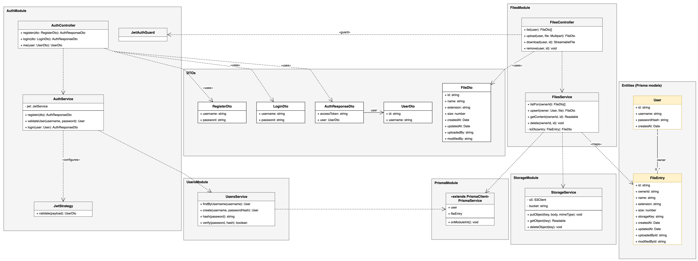
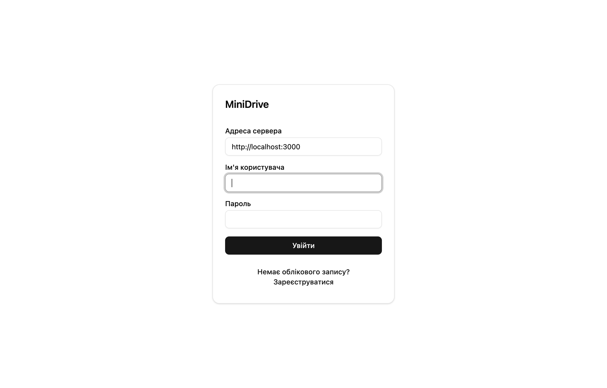
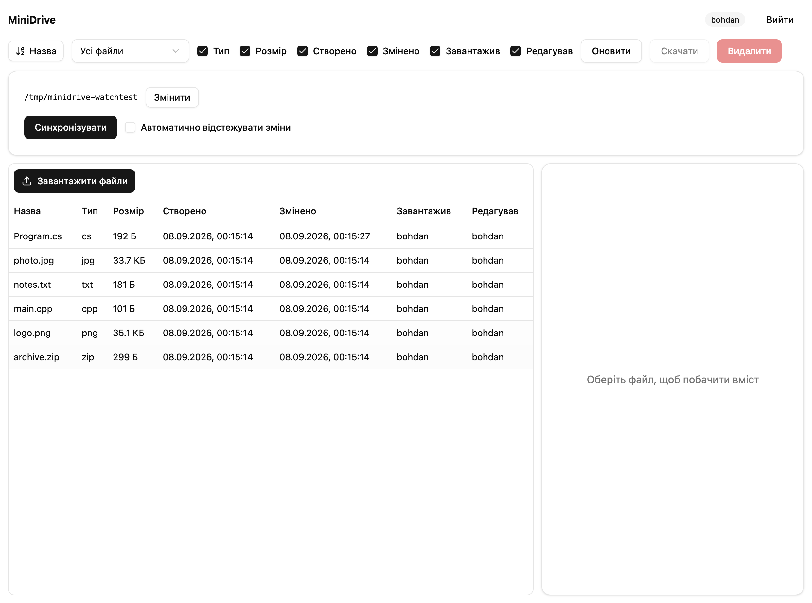
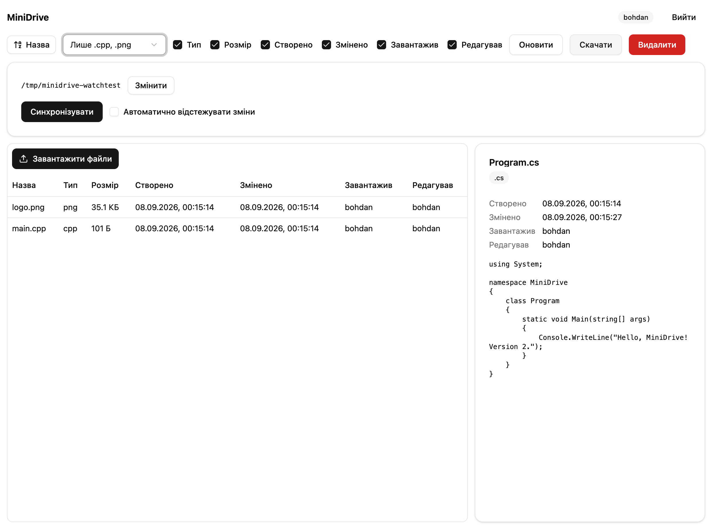
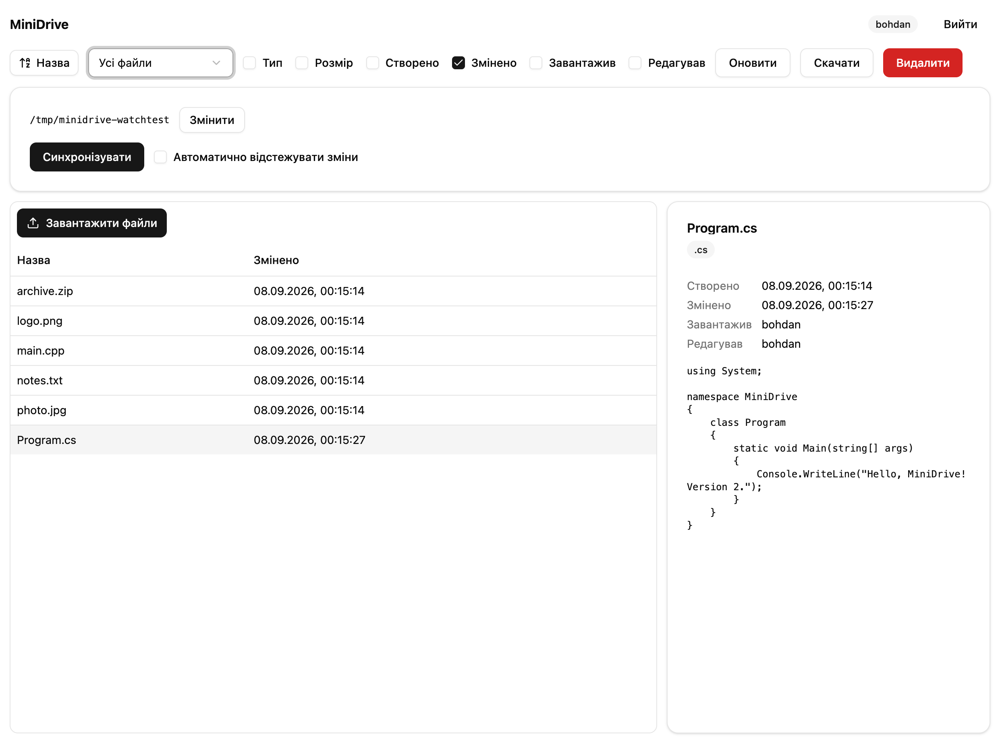
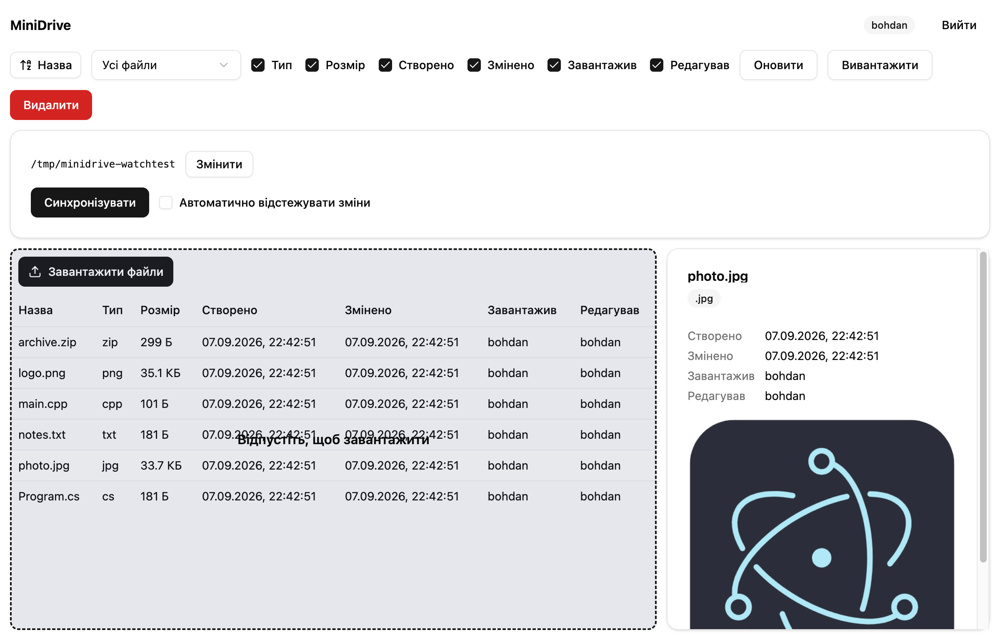
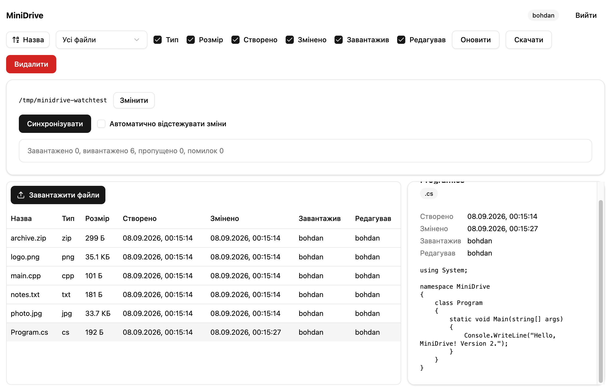

# Постановка задачі

**Посилання на GitHub:** <https://github.com/AIAvenger1/minidrive>

Завдання етапу 2 — реалізувати десктоп-клієнт (Electron) і серверну частину (NestJS) системи MiniDrive для варіанта 4-6, спроєктованої на етапі 1 (звіт `stage1-uml.md`): реєстрацію та вхід, перегляд файлів власного простору з атрибутами, сортування за назвою, фільтр «лише `.cpp`» / «лише `.png`», перегляд вмісту `.cs` як тексту та `.jpg` як зображення, завантаження/скачування/видалення файлів, синхронізацію локальної папки з віддаленим простором, а також обидва бонуси — drag-and-drop при завантаженні та скачуванні. Постановку задачі, аналіз вимог і UML-специфікацію детально описано на етапі 1; цей звіт фіксує їх реалізацію, unit-тести та результати запуску.

# Архітектура реалізації

Проєкт — монорепозиторій на Yarn 4 workspaces (`packageManager: yarn@4.9.1`, `nodeLinker: node-modules`, без PnP):

- `packages/shared` — спільна TypeScript-логіка без залежностей від Electron, DOM чи Node: типи (`FileDto`, `UserDto`, `AuthResponseDto` тощо), `ApiClient` (обгортка над REST), чисті функції варіанта `sortByName`/`filterByType`, `previewKindOf`/`createPreview`, `toggleColumn`, `DriveViewModel` (фасад стану екрана) та `computeSyncPlan` (правила синхронізації). Пакет збирається у dual ESM/CJS і використовується і десктоп-, і майбутнім веб-клієнтом.
- `packages/ui` — презентаційні компоненти на React + shadcn/Tailwind (`FileTable`, `SortControl`, `FilterControl`, `ColumnToggle`, `PreviewPanel`, `UploadDropzone`), незалежні від платформи: усе платформозалежне передається пропсами.
- `apps/api` — сервер NestJS: модулі `auth`, `users`, `files`, `storage`, `prisma`.
- `apps/desktop` — Electron-застосунок (electron-vite): процеси `main` (вікно, IPC, `SyncEngine`, `FolderWatcher`, `LocalFolderScanner`, `DragOutHandler`), `preload` (`PreloadBridge`, тобто `window.minidrive`) і `renderer` (React-екрани `LoginScreen`/`DriveScreen` на компонентах `packages/ui`).

Відповідність діаграмам етапу 1: компонентна структура (рис. 1 етапу 1, `docs/uml/img/15-component.png`) один в один відповідає поділу на `packages/shared`, `apps/api` і три процеси `apps/desktop`; діаграма класів сервера (рис. 6, `docs/uml/img/04-class-server.png`) — контролерам/сервісам NestJS нижче; діаграма класів клієнтів (рис. 7, `docs/uml/img/05-class-clients.png`) — файлам `packages/shared/src/*.ts` і компонентам `packages/ui`.

{width=16cm}

{width=16cm}

{width=16cm}

# Сервер

REST API (NestJS, префікс без версії, порт 3000):

| Метод і шлях | Призначення | Успіх | Помилки |
|-------------|------------|----------|---------------|
| `POST /auth/register` | реєстрація нового користувача | 201, `AuthResponseDto` | 409 — ім'я зайняте, 400 — валідація |
| `POST /auth/login` | вхід за логіном/паролем | 200, `AuthResponseDto` | 401 — невірний пароль |
| `GET /auth/me` | поточний користувач за токеном | 200, `UserDto` | 401 |
| `GET /files` | список файлів власного простору | 200, `FileDto[]` | 401 |
| `POST /files` | завантаження файлу (multipart, поле `file`) | 201, `FileDto` | 401, 413 — понад 50 МБ, 400 |
| `GET /files/:id/content` | вміст файлу (стрім) | 200, потік байтів | 401, 404 — файл не в просторі викликача |
| `DELETE /files/:id` | видалення файлу | 204 | 401, 404 |

Автентифікація — JWT HS256 з часом життя 24 год у заголовку `Authorization: Bearer <token>`; паролі хешуються bcrypt (10 раундів). Дані зберігаються в PostgreSQL через Prisma; модель `FileEntry` містить `ownerId`, `name`, `extension`, `size`, `storageKey`, `createdAt`, `updatedAt`, `uploadedById`, `modifiedById` і унікальний індекс `(ownerId, name)`; модель `User` — `id`, `username` (унікальний), `passwordHash`.

Вміст файлів зберігається в MinIO (S3-сумісне сховище), бакет `minidrive`, ключ об'єкта — `users/{ownerId}/{fileEntry.id}`. `StorageService` інкапсулює `putObject`/`getObject`/`deleteObject` і за потреби створює бакет при старті (`onModuleInit`).

Правило перезапису: якщо завантажене ім'я вже існує у просторі того самого власника, `FilesService.upsert` не створює новий рядок, а лишає той самий `FileEntry.id` і `storageKey`, замінює байти в MinIO, ставить `updatedAt = now()` і `modifiedById = caller`. Це перевірено тестом `FilesService.upsert`: «overwrites an existing name: same id and key, new bytes, modifiedBy = caller» (`apps/api/src/files/files.service.spec.ts`).

Стек піднімається `docker compose` (`docker/compose.yml`): сервіси `postgres`, `minio` та `api` (образ будується з `docker/api.Dockerfile`), усі з healthcheck. У робочому стані:

{width=15cm}

Специфікація REST-інтерфейсу автоматично публікується через `@nestjs/swagger` на `/docs`:

{width=13cm}

Наскрізна перевірка проти живого стеку — скрипт `tools/api-smoke.sh` (реєстрація/вхід відсутні, бо користувачі вже засіяні `db:seed`; сценарій: вхід → завантаження → список → скачування → видалення), який використано замість e2e-тесту supertest (узгоджене відхилення від §7 специфікації).

# Десктоп-клієнт

Нижче — кожна функція десктоп-клієнта зі скриншотом. Знімки зроблено в чистому стані: вхід під `bohdan`, завантаження `Program.cs`, `photo.jpg`, `main.cpp`, `logo.png`, `notes.txt`, `archive.zip`, повторне завантаження `Program.cs` (щоб «Змінено» відрізнялося від «Створено»); після зйомки тестові файли видалено з сервера.

## Вхід і адреса сервера

Екран входу (`LoginScreen`) має поле «Адреса сервера» (за замовчуванням `http://localhost:3000`, зберігається в `electron-store` через `SessionStore`), ім'я користувача й пароль; той самий екран перемикається в режим реєстрації. Змінюючи адресу сервера, клієнт можна спрямувати на інший (наприклад, опублікований в інтернеті) інстанс API без перезбирання застосунку.

{width=11cm}

## Таблиця файлів і атрибути

`FileTable` показує «Назва», «Тип», «Розмір», «Створено», «Змінено», «Завантажив», «Редагував». Оскільки простори персональні і функція «поділитися» поза межами проєкту (sharing out of scope), у власному просторі «Завантажив» і «Редагував» завжди показують того самого користувача — це очікувана поведінка, а не помилка; стовпці все одно виведено обидва, щоб інтерфейс був готовий до можливого розширення. Значення розходяться, коли файл із тим самим іменем завантажується повторно: «Редагував» лишається як є (той самий викликач у персональному просторі), а «Змінено» оновлюється — новий файл `Program.cs` це демонструє (розділ «Синхронізація» нижче: «Змінено» 00:15:27 проти «Створено» 00:15:14).

{width=15cm}

## Сортування за назвою (операція варіанта)

`SortControl` перемикає порядок сортування за клацанням на «Назва»; сортування стабільне, регістронезалежне, з `localeCompare(..., { numeric: true })` (`sortByName`, `packages/shared/src/fileList.ts`).

{width=15cm}

## Фільтр за типом (операція варіанта)

`FilterControl` — перемикач «Усі файли» / «Лише `.cpp`» / «Лише `.png`» (`filterByType`, регістронезалежний за розширенням).

{width=15cm}

## Показ/приховування стовпців

`ColumnToggle` — прапорці для всіх стовпців, крім «Назва», яку приховати неможливо (перевірено тестом `toggleColumn`: «never hides the name column»).

{width=15cm}

## Перегляд вмісту: `.cs` як текст, `.jpg` як зображення (тип варіанта)

`PreviewPanel` викликає `createPreview`/`previewKindOf` із `packages/shared`: текстові розширення (зокрема `.cs`) рендеряться як текст, растрові зображення (зокрема `.jpg`) — як ``.

{width=15cm}

{width=15cm}

## Завантаження: кнопка та drag-and-drop (бонус)

`UploadDropzone` поєднує кнопку «Завантажити файли» (прихований `<input type="file" multiple>`) і зону перетягування: `onDragOver` показує підказку «Відпустіть, щоб завантажити», `onDrop` передає файли в той самий обробник завантаження, що й кнопка.

{width=15cm}

## Скачування і перетягування назовні (бонус)

Кнопка «Скачати» зберігає вміст обраного файлу через нативний діалог збереження (`window.minidrive.file.saveAs`, головний процес, `dialog.showSaveDialog`). Перетягування рядка таблиці назовні вікна обробляє `DragOutHandler` у головному процесі (`window.minidrive.file.dragOut`) — Electron записує тимчасовий файл і починає системний drag, тож файл можна відпустити у Finder або іншому застосунку.

## Видалення

Кнопка «Видалити» відкриває діалог підтвердження (`Dialog`/`DialogFooter` з `packages/ui`) і після підтвердження викликає `DELETE /files/:id`.

## Прив'язка папки

Панель синхронізації (`SyncPanel`) дозволяє прив'язати локальну папку через нативний діалог вибору директорії (`window.minidrive.folder.pick`, `dialog.showOpenDialog` з `openDirectory`); шлях зберігається в налаштуваннях і показується поруч із кнопкою «Змінити».

## Синхронізація та автоматичне відстеження

Кнопка «Синхронізувати» викликає `SyncEngine.synchronize()`: `LocalFolderScanner.scan()` читає локальну папку, `ApiClient.listFiles()` — віддалений список, `computeSyncPlan` будує план дій, які виконуються послідовно; результат — `SyncReport` (`uploaded`, `downloaded`, `skipped`, `failed`, `errors`), показаний у панелі. Прапорець «Автоматично відстежувати зміни» вмикає `FolderWatcher.startWatching()` (chokidar, дебаунс 2 с): кожна зміна у прив'язаній папці запускає нову синхронізацію без участі користувача; `stopWatching()` вимикає стеження.

{width=15cm}

## Правила синхронізації

Реалізовано в `computeSyncPlan` (`packages/shared/src/sync.ts`) і покрито тестами `sync.test.ts` та `syncEngine.test.ts`: файл лише локально → надсилається; файл лише віддалено → скачується; за наявності з обох боків з однаковим розміром і `|mtime − updatedAt| ≤ 2000` мс — пропускається; інакше перемагає новіша версія (за `mtime`/`updatedAt`); видалення ніколи не поширюються в інший бік (видалення локально відновлює файл з сервера і навпаки); після скачування локальний `mtime` виставляється рівним `updatedAt` сервера, щоб наступна синхронізація не вважала файл зміненим.

# Unit-тестування

Файли тестів подано як «робочий простір / файл»: `shared` — `packages/shared/src`, `api` — `apps/api/src` (з підкаталогами модулів), `desktop` — `apps/desktop/src/main/sync`.

| Файл тестів | Що перевіряє | К-сть |
|-----------------|----------------------------|----|
| shared / `fileList.test.ts` | `sortByName` (зростання/спадання, стабільність, регістронезалежність — **операція варіанта**), `filterByType` (усі файли / лише `.cpp` / лише `.png` — **операція варіанта**, окремо копія масиву для `'all'`), `extensionOf` (звичайне розширення й порожнє для імені, що закінчується голою крапкою), `isSafeFileName`, `isSyncableName` | 12 |
| shared / `preview.test.ts` | `previewKindOf` для типів варіанта `.cs`→текст, `.jpg`→зображення, узагальнено для інших текстових/растрових, `'none'` для інших; `createPreview`; `FilePreview.canRender` | 7 |
| shared / `columns.test.ts` | `toggleColumn`, незнімний стовпець «Назва» | 2 |
| shared / `driveViewModel.test.ts` | `DriveViewModel`: застосування сортування й фільтра варіанта до `visibleFiles`, неможливість приховати «Назва» | 2 |
| shared / `apiClient.test.ts` | `ApiClient`: bearer-токен, `ApiError` зі статусом, multipart з полем `file`, обрізання кінцевого слеша базової адреси, скачування як blob, видалення файлу, реєстрація, `undefined` на відповідь 204, об'єднання масиву повідомлень помилки | 9 |
| shared / `sync.test.ts` | `computeSyncPlan`: лише локально/лише віддалено, пропуск у межах похибки годинника, перемога новішої версії, різниця розміру як зміна, скачування замість помилки при непридатній для розбору мітці часу сервера; `emptySyncReport`, `failedSyncReport` | 9 |
| api / `auth.service.spec.ts` | реєстрація, 409 на зайняте ім'я, 401 на невірний пароль, вхід | 4 |
| api / `jwt.strategy.spec.ts` | `JwtStrategy.validate`: повертає поточного користувача, відхиляє токен видаленого користувача | 2 |
| api / `config.spec.ts` | `loadConfig`: типовий порт, коли `PORT` не число | 1 |
| api / `files.controller.spec.ts` | `FilesController.upload`: 400 на завантаження без файлу | 1 |
| api / `files.service.spec.ts` | `FilesService.upsert` (створення, **перезапис з тим самим id/key**), валідація імені, чужий простір (404), відкат рядка при помилці сховища, порядок видалення | 8 |
| api / `storage.service.spec.ts` | `StorageService.putObject/getObject/deleteObject`, створення бакета при відсутності | 3 |
| api / `users.service.spec.ts` | bcrypt-хеш пароля, пошук за іменем | 2 |
| desktop / `syncEngine.test.ts` | `SyncEngine.scan/synchronize`: завантаження та скачування зі встановленням mtime, пропуск ідентичних, підрахунок помилок без переривання, захист від виходу за межі каталогу (шлях і зворотний слеш), пропуск скачування файлу з крапкою на початку імені, звіт про прогрес (`onProgress`) | 7 |

Разом: **shared — 41**, **api — 21**, **desktop — 7**, усього 69 тестів, усі проходять (`yarn test` з кореня):

{width=15cm}

# Інструкція із запуску

```bash
corepack enable
yarn install
cp docker/.env.example docker/.env
yarn stack:up
yarn workspace @minidrive/api db:seed
yarn workspace @minidrive/desktop dev
```

`yarn stack:up` піднімає `postgres`, `minio` та `api` в Docker (`docker compose -f docker/compose.yml up -d --build --wait`) і чекає на healthcheck усіх трьох сервісів; `yarn workspace @minidrive/api db:seed` створює тестових користувачів (`bohdan`, `olena`, `taras`, пароль `secret123`). `yarn workspace @minidrive/desktop dev` запускає Electron-клієнт у режимі розробки (electron-vite); `yarn workspace @minidrive/desktop build:mac` (або `build:win`/`build:linux`) збирає розповсюджуваний застосунок.

Змінні середовища сервера (`docker/.env`, копія з `docker/.env.example`, у git не потрапляє): `POSTGRES_USER`/`POSTGRES_PASSWORD`/`POSTGRES_DB`, `MINIO_ROOT_USER`/`MINIO_ROOT_PASSWORD`, `JWT_SECRET`, `API_PORT`, `CORS_ORIGINS`.

Щоб підключити десктоп-клієнт до віддаленого (не локального) сервера, достатньо на екрані входу вказати в полі «Адреса сервера» URL опублікованого API (наприклад, `https://minidrive.example.com`) замість `http://localhost:3000` — значення зберігається в `electron-store` й використовується для всіх наступних запитів `ApiClient`, перезбирання застосунку не потрібне.

# Пакування

`yarn workspace @minidrive/desktop build:mac` (electron-builder) успішно зібрав застосунок під ідентифікатором `appId: ua.knu.minidrive` і назвою `productName: MiniDrive`; підписання коду вимкнено `identity: null` у розділі `mac` `apps/desktop/electron-builder.yml` (сертифікатів розробника в системі немає — очікувано для навчального середовища), а шаблон імені артефактів (`nsis`/`mac`/`dmg`: `artifactName: ${productName}-${version}-${arch}.${ext}`) явно використовує `productName` замість повного, зі скоупом, імені пакета. Перша спроба збірки `.dmg` завершувалася помилкою, бо типовий шаблон electron-builder підставляв саме ім'я пакета `@minidrive/desktop` (зі слешем зі скоупу) у шлях файлу; після явного завдання `artifactName` збірка проходить повністю. Результат: `apps/desktop/dist/MiniDrive-1.0.0-arm64.dmg` і `apps/desktop/dist/MiniDrive-1.0.0-arm64.zip`.

# Висновки

На етапі 2 реалізовано REST-сервер (NestJS, PostgreSQL, MinIO) і десктоп-клієнт (Electron) системи MiniDrive за специфікацією етапу 1: усі функціональні вимоги типу 2, обидві операції варіанта (сортування за назвою, фільтр `.cpp`/`.png`), обидва типи перегляду варіанта (`.cs`, `.jpg`) і обидва бонуси (drag-and-drop при завантаженні та скачуванні) реалізовано й перевірено вручну через 12 знімків екрана. Поведінку ключових функцій — сортування, фільтрації, перегляду, атрибутів перезапису та правил синхронізації — покрито 69 unit-тестами (shared 41, api 21, desktop 7), усі проходять. Наскрізну працездатність стеку підтверджує `tools/api-smoke.sh` проти запущеного `docker compose`. Пакування в розповсюджуваний `MiniDrive-1.0.0-arm64.dmg`/`.zip` для macOS пройшло повністю успішно. Наступний етап (3) — веб-орієнтована версія клієнта на тому самому пакеті `packages/shared`.
