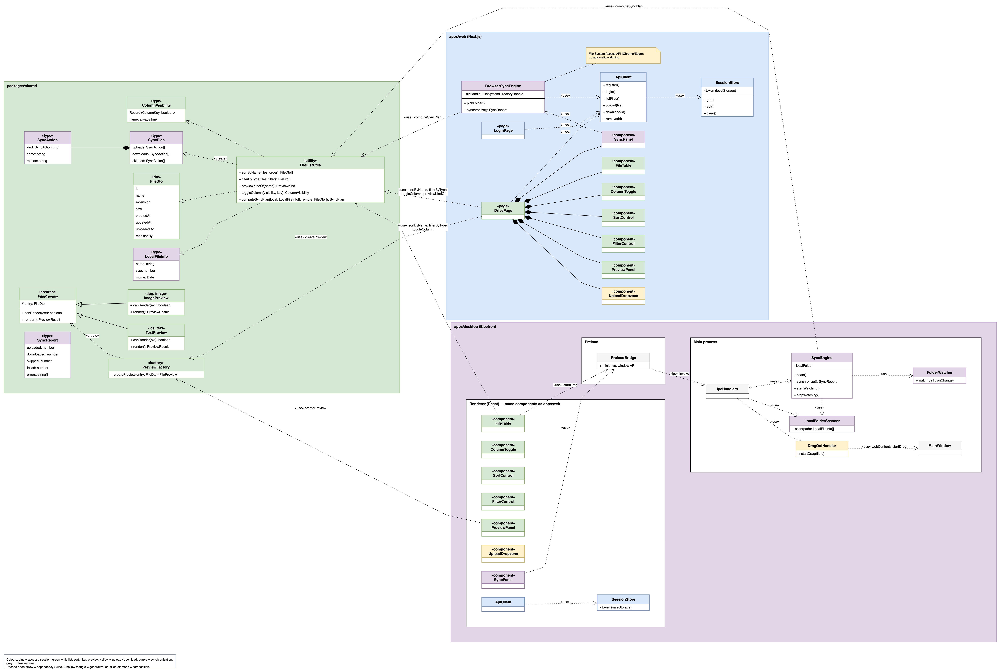
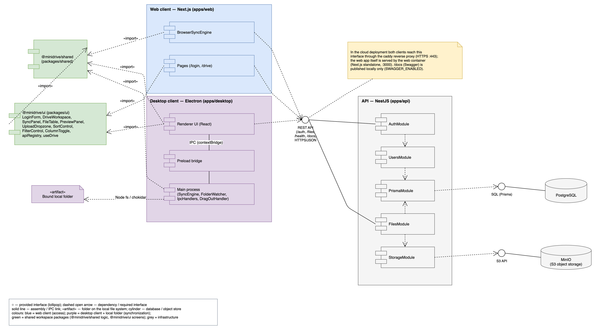
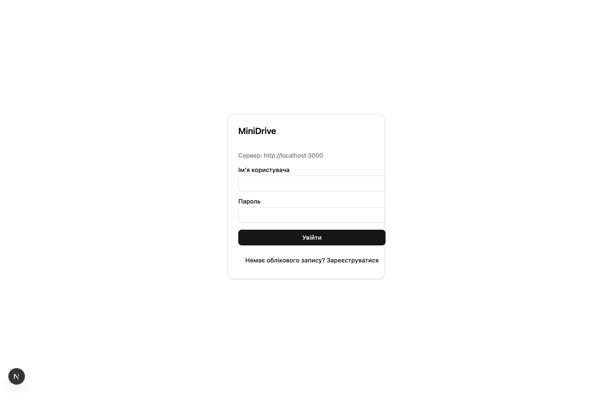
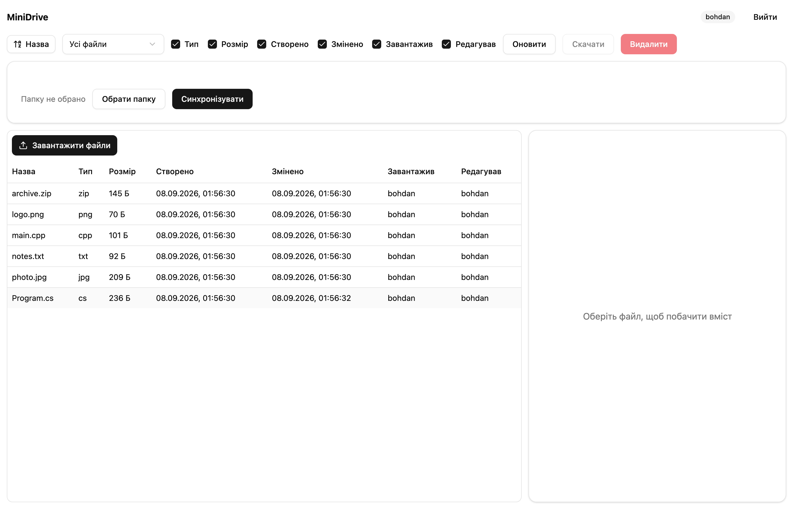
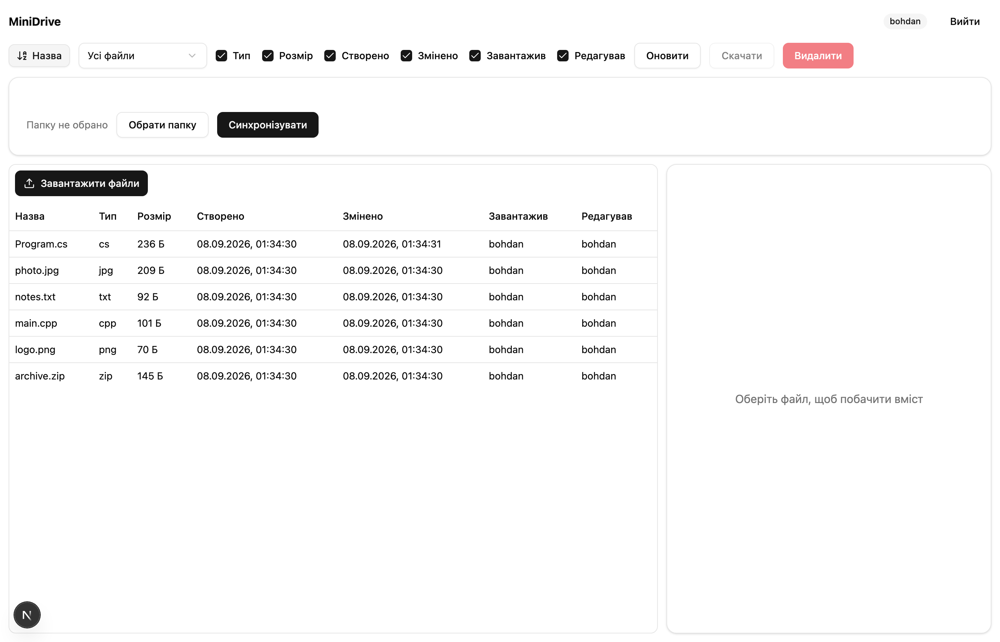
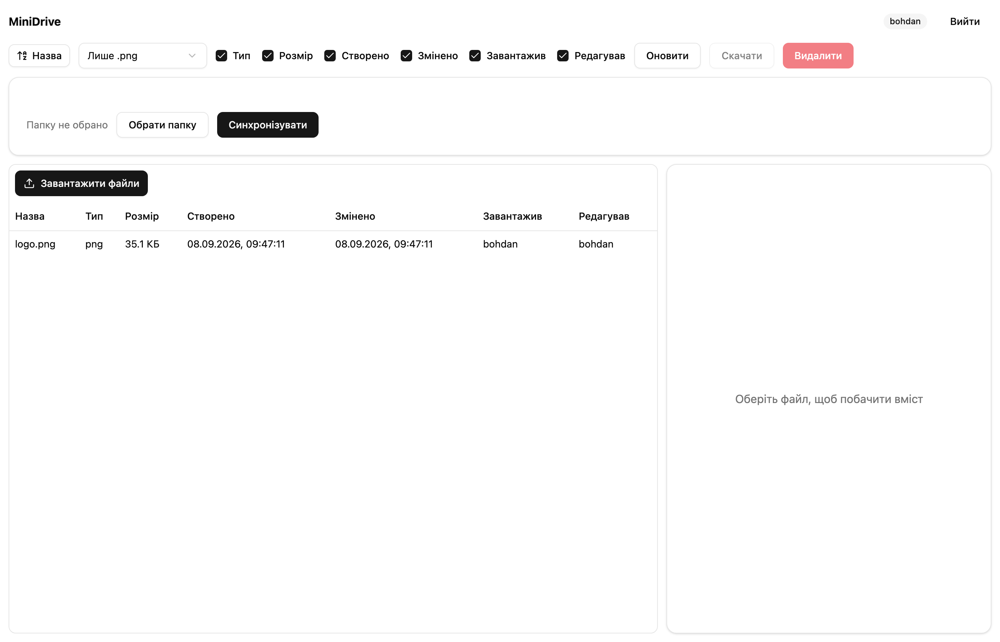
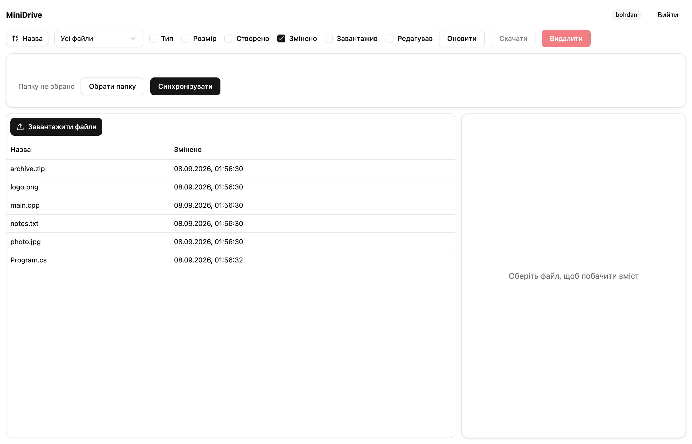
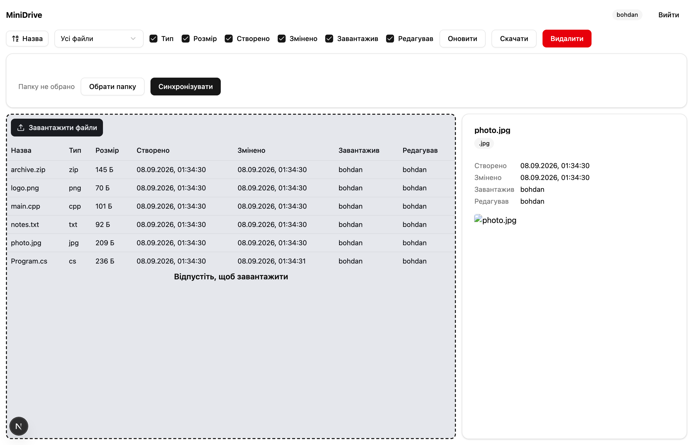
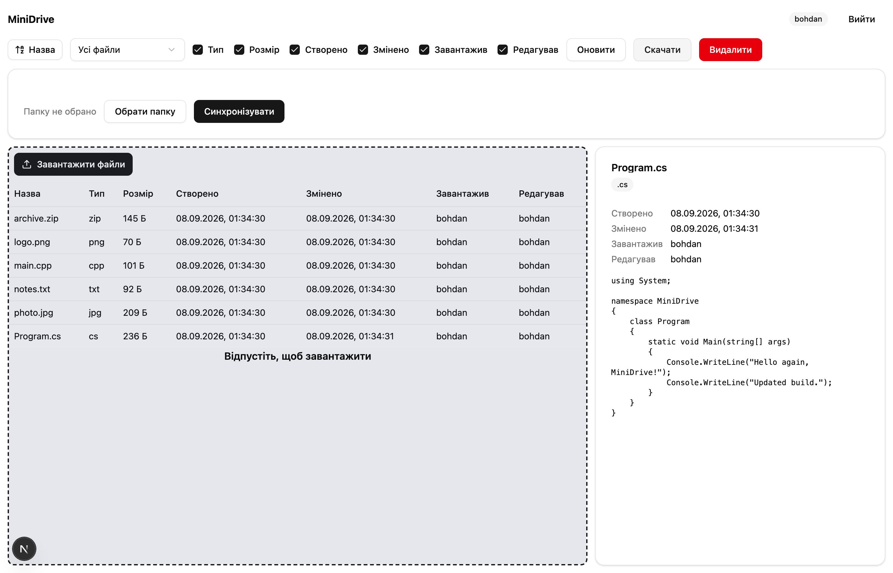
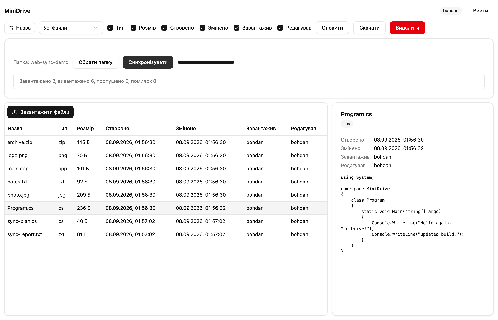

# Постановка задачі етапу 3

Завдання етапу 3 — реалізувати веб-орієнтовану версію клієнта MiniDrive для варіанта 4-6 поверх того самого сервера (NestJS, REST-контракт без змін), не дублюючи логіку, вже реалізовану на етапі 2: реєстрацію та вхід, перегляд файлів власного простору з атрибутами, сортування за назвою (операція варіанта), фільтр «лише `.cpp`» / «лише `.png`» (операція варіанта), перегляд `.cs` як тексту та `.jpg` як зображення (типи варіанта), завантаження (кнопкою і drag-and-drop), скачування, видалення та синхронізацію локальної папки з віддаленим простором — вимоги R1–R9 із специфікації етапу 1. Оскільки браузер не має прямого доступу до файлової системи так, як настільний застосунок, синхронізація реалізована через File System Access API з узгодженим відхиленням від правил §4.2 (журнал синхронізації замість встановлення mtime — див. розділ 5). Бонусним завданням етапу є підготовка серверної частини та веб-клієнта до публікації в інтернеті (production-розгортання за HTTPS).

# Архітектура

Проєкт лишається монорепозиторієм на Yarn 4 workspaces; етап 3 додає до нього `apps/web` — застосунок на Next.js (App Router), що працює поруч із `apps/desktop` і використовує той самий сервер `apps/api` і ті самі спільні пакети:

- `packages/shared` не змінював свій контракт для клієнтів (`ApiClient`, `sortByName`/`filterByType`, `previewKindOf`/`createPreview`, `DriveViewModel`, `computeSyncPlan`) і отримав лише доповнення для браузерної синхронізації — `syncLedger.ts` (`SyncLedger`, `reconcileWithLedger`, `recordTransfer`, `pruneLedger`), описане в розділі 5.
- `packages/ui` отримав два нових компоненти, спільні для десктоп- і веб-клієнта: `LoginForm` (екран входу/реєстрації з опціональним полем адреси сервера, `allowServerChange`) і `DriveWorkspace` (весь екран роботи з файлами: шапка, `SortControl`, `FilterControl`, `ColumnToggle`, `UploadDropzone` із вбудованою `FileTable`, `PreviewPanel`, діалог підтвердження видалення). `DriveWorkspace` не знає, як платформа зберігає файл на диск чи як виглядає панель синхронізації, — ці речі передаються пропсами (`saveFile`, `onRowDragStart`, `renderSyncPanel`), тому один і той самий компонент рендериться і в Electron-рендерері, і в Next.js. Модуль `apiRegistry.ts` тримає єдиний екземпляр `ApiClient` для UI-шару (`configureApi`/`getApi`).
- `apps/web` — тонкий Next.js-шар над `packages/ui`: сторінка `/login` (`src/app/login/page.tsx`) рендерить `LoginForm` без можливості змінити адресу сервера (`allowServerChange` не передано) і зберігає токен через `SessionStore` (`src/lib/session.ts`, ключ `minidrive.token` у `localStorage`); сторінка `/drive` (`src/app/drive/page.tsx`) рендерить `DriveWorkspace`, передаючи йому `saveFile` через `saveBlob` (`src/lib/download.ts`, тимчасове посилання `<a download>`) і панель синхронізації `SyncPanel` (`src/components/SyncPanel.tsx`). Хук `useSession` (`src/hooks/useSession.ts`) перевіряє токен і викликає `GET /auth/me` при вході на `/drive`, перенаправляючи на `/login` при відсутності або недійсності токена.
- REST-контракт сервера не змінився: ті самі маршрути `/auth/*`, `/files*`, ті самі коди помилок, той самий `FileDto`.

Відповідність діаграмам: клас-діаграма спільного пакета й клієнтів (рис. нижче, `docs/uml/img/05-class-clients.png`) оновлена для етапу 3 — на ній видно, що `DriveWorkspace` і `LoginForm` розташовані в `packages/ui` та використовуються обома клієнтами, а `SyncLedger` доданий до `packages/shared`. Компонентна діаграма (`docs/uml/img/15-component.png`) відображає нову структуру розгортання: поруч із процесами `apps/desktop` з'явився `apps/web`, що звертається до того самого `apps/api`.

{width=16cm}

{width=16cm}

# Технології

- **Next.js 16** (App Router, Turbopack у режимі розробки) — маршрутизація `/login` і `/drive`, серверний рендер оболонки сторінки, клієнтські компоненти (`'use client'`) для всієї інтерактивної частини.
- **React 19**, **Tailwind CSS v4** і **shadcn/ui** (ті самі примітиви `Button`, `Card`, `Dialog`, `Select`, `Table`, `Checkbox`, `Progress`, `Alert`, що й у десктоп-клієнті) — весь візуальний шар живе в `packages/ui` і не залежить від Next.js.
- Спілкування з сервером — той самий `ApiClient` із `packages/shared` через REST (`fetch`, `Authorization: Bearer <token>`), без жодного проміжного BFF-шару: `apps/web` — це статичний/SSR-фронтенд, що ходить у `NEXT_PUBLIC_API_URL` напряму з браузера.
- Сесія користувача зберігається в `localStorage` (`minidrive.token`), а не в `electron-store`, як у десктоп-клієнта, — це єдина суттєва відмінність у зберіганні стану між клієнтами, зумовлена середовищем виконання (браузер проти Node-процесу).

# Веб-клієнт

Нижче — кожна функція веб-клієнта зі знімком екрана. Знімки зроблено проти реального запущеного стеку (`docker/compose.yml`) у чистому стані: вхід під `bohdan`, завантаження `Program.cs`, `photo.jpg`, `main.cpp`, `logo.png`, `notes.txt`, `archive.zip`, повторне завантаження `Program.cs` з іншим вмістом (щоб «Змінено» відрізнялося від «Створено»); після зйомки тестові файли видалено з сервера.

## Вхід

Сторінка `/login` рендерить спільний `LoginForm` у режимі без зміни адреси сервера — вона підписана рядком «Сервер: `NEXT_PUBLIC_API_URL`», щоб було зрозуміло, до якого API йде звернення, але саме поле недоступне для редагування (на відміну від десктоп-клієнта, де адресу сервера можна змінити в самому застосунку). Форма перемикається між входом і реєстрацією тим самим компонентом, що й у Electron-рендерері.

{width=11cm}

## Таблиця файлів і атрибути

`FileTable` (усередині `DriveWorkspace`) показує ті самі сім стовпців, що й на десктопі: «Назва», «Тип», «Розмір», «Створено», «Змінено», «Завантажив», «Редагував». Повторне завантаження `Program.cs` з іншим вмістом залишає «Створено» незмінним і оновлює лише «Змінено» — та сама поведінка `FilesService.upsert`, перевірена на етапі 2.

{width=15cm}

## Сортування за назвою (операція варіанта)

Кнопка «Назва» на панелі керування перемикає порядок; сортування виконує та сама функція `sortByName` (`packages/shared`), стабільна, регістронезалежна, з `localeCompare(..., { numeric: true })`.

{width=15cm}

## Фільтр за типом (операція варіанта)

`FilterControl` — той самий випадаючий список «Усі файли» / «Лише `.cpp`» / «Лише `.png`».

{width=15cm}

## Показ/приховування стовпців

`ColumnToggle` дозволяє приховати будь-які стовпці, крім «Назва» (перевірено тестом `toggleColumn`). На знімку приховано п'ять із шести необов'язкових стовпців — лишились «Назва» і «Змінено».

{width=15cm}

## Перегляд вмісту: `.cs` як текст, `.jpg` як зображення (тип варіанта)

`PreviewPanel` викликає `createPreview`/`previewKindOf` із `packages/shared` — той самий код, що й на десктопі: текстові розширення (зокрема `.cs`) рендеряться як `<pre>`, растрові зображення (зокрема `.jpg`) — як `` через `URL.createObjectURL`.

{width=15cm}

{width=15cm}

## Завантаження: кнопка та drag-and-drop (бонус)

`UploadDropzone` поєднує кнопку «Завантажити файли» (прихований `<input type="file" multiple>`) і зону перетягування: `onDragOver` показує підказку «Відпустіть, щоб завантажити», `onDrop` передає файли в той самий обробник завантаження, що й кнопка, — компонент ідентичний десктопному, лише події перетягування тепер браузерні (`DragEvent`), а не з IPC-мосту Electron.

{width=15cm}

## Скачування

Кнопка «Скачати» викликає `saveBlob` (`apps/web/src/lib/download.ts`): вміст файлу, отриманий через `ApiClient.download`, обгортається в `URL.createObjectURL` і «клікається» тимчасовим елементом `<a download>` — веб-еквівалент нативного діалогу збереження на десктопі. У headless-режимі Chrome не показує системну панель завантаження, тому знімок фіксує натиснуту кнопку «Скачати» (стан `:active` під час утримання кнопки миші); саму подію початку завантаження браузер підтвердив подією `Page.downloadWillBegin` з `suggestedFilename: "Program.cs"` (зафіксовано в лозі зйомки, розділ «Спосіб зйомки» звіту про виконання завдання).

{width=15cm}

## Видалення

Кнопка «Видалити» відкриває той самий діалог підтвердження (`Dialog`/`DialogFooter` з `packages/ui`), що й на десктопі, і після підтвердження викликає `DELETE /files/:id`.

# Синхронізація папки в браузері

На відміну від Electron, у якого є прямий доступ до файлової системи через процес `main` (`LocalFolderScanner`, `FolderWatcher`, Node `fs`), веб-сторінка може працювати з локальною папкою користувача лише в межах **File System Access API** (`window.showDirectoryPicker`), що діє тільки в Chromium-браузерах (Chrome, Edge; Firefox і Safari цей API не підтримують — `SyncPanel` перевіряє це через `supportsFolderSync()` і замість панелі показує попередження «Синхронізація папки недоступна в цьому браузері. Потрібен Chrome або Edge»). Користувач один раз підтверджує доступ до папки в системному діалозі («Обрати папку»), після чого `BrowserSyncEngine` (`apps/web/src/lib/browserSync.ts`) читає її вміст через `FileSystemDirectoryHandle.values()` і записує в неї через `FileSystemFileHandle.createWritable()` — той самий алгоритм плану синхронізації `computeSyncPlan` з `packages/shared`, що й у `SyncEngine` на десктопі: файл лише локально → надсилається (`api.upload`), файл лише віддалено → скачується (`api.download`), деінде — новіша версія перемагає, видалення не поширюються.

Ключове узгоджене відхилення від правил §4.2: у Node (`apps/desktop`) після скачування файлу локальний `mtime` встановлюється рівним `updatedAt` сервера (`fs.utimes`), щоб наступне сканування не вважало щойно скачаний файл зміненим. **File System Access API не дає веб-сторінці способу встановити довільний `lastModified` файлу** — браузер завжди підставляє реальний момент запису на диск. Тому веб-клієнт замінює встановлення mtime **журналом синхронізації** (`SyncLedger`, `packages/shared/src/syncLedger.ts`): після кожного передавання файлу (`recordTransfer`) у журнал (окремий на кожну прив'язану папку, ключ `minidrive.sync.<назва папки>` у `localStorage`, `syncLedgerStore.ts`) записуються розмір, реальний `mtime` файлу на диску й серверний `updatedAt` на момент передавання. Перед побудовою плану синхронізації `reconcileWithLedger` звіряє поточний `mtime` файлу із запам'ятованим у журналі значенням: якщо розмір і `mtime` не змінились із моменту останнього передавання, файл вважається логічно синхронізованим на серверний `updatedAt`, і `computeSyncPlan` коректно пропускає його (`skipped`), а не перезавантажує щоразу через невідповідність міток часу. `pruneLedger` прибирає з журналу записи про файли, яких уже немає в папці, — тест `syncLedger.test.ts` (6 випадків) перевіряє всі три функції журналу окремо, а `browserSync.test.ts` (4 випадки, `apps/web`) — інтеграцію журналу з `BrowserSyncEngine` на памʼятевій фейковій директорії (`DirectoryHandleLike`), зокрема сценарій «пропускає файл, який журнал уже знає, хоча браузер не міг встановити його mtime». Журнал прив'язаний до папки за її *назвою* (`FileSystemDirectoryHandle` не надає повного шляху), тому дві різні папки з однаковою назвою (наприклад, дві теки `work` в різних місцях диска) поділяють один журнал — це прийняте обмеження веб-версії, не варте обходу через окреме сховище ідентифікаторів для навчального проєкту.

Інше прийняте обмеження браузерної версії — **відсутність автоматичного спостереження за папкою** (аналога `FolderWatcher`/chokidar із десктоп-клієнта): File System Access API не надає події зміни файлів у прив'язаній директорії, тому синхронізація в `apps/web` лише ручна, за кнопкою «Синхронізувати» — прапорця «Автоматично відстежувати зміни» в `SyncPanel` немає.

На знімку нижче до синхронізації прив'язана порожня (з погляду сервера) папка з двома новими локальними файлами; на сервері вже лежало шість файлів із розділу «Веб-клієнт» вище. Звіт після синхронізації — реальні числа з живого API: «Надіслано 2, скачано 6, пропущено 0, помилок 0» (два нових локальних файли надіслано на сервер, шість файлів сервера скачано в папку).

{width=15cm}

# Тестування

Файли тестів подано як «робочий простір / файл»: `web` — `apps/web/src/lib`, `shared` — `packages/shared/src`.

| Файл тестів | Що перевіряє | К-сть |
|-----------------|----------------------------|----|
| web / `browserSync.test.ts` | `BrowserSyncEngine.synchronize` на пам'ятевій фейковій директорії: одночасне надсилання локального-лише файлу й скачування віддаленого-лише файлу з фіксацією обох у журналі; пропуск файлу, який журнал уже знає, попри неможливість браузера встановити mtime; підрахунок помилок без переривання решти передавань і звіт про прогрес (`onProgress`) | 4 |
| shared / `sync.test.ts` (нові випадки) | `runSyncPlan` — спільний цикл виконання плану для обох клієнтів: підрахунок надісланих/скачаних/пропущених файлів, фіксація помилки без переривання решти передавань, повідомлення про прогрес, зникнення віддаленого запису як помилка | 4 |
| shared / `syncLedger.test.ts` | `reconcileWithLedger` (підміна `mtime` на серверний за збігом розміру й mtime, залишення «сирого» файлу без змін інакше), `recordTransfer`, `pruneLedger` (видалення записів про зниклі файли) | 6 |

Ці три групи тестів — приріст етапу 3 до набору тестів, успадкованого від етапу 2 (`packages/shared` — сортування, фільтрація, перегляд, стовпці, `DriveViewModel`, `ApiClient`, правила синхронізації; `apps/api` — автентифікація, файли, сховище, користувачі, конфігурація; `apps/desktop` — `SyncEngine`). Разом: **shared — 51**, **api — 23**, **desktop — 7**, **web — 4**, усього **85** тестів, усі проходять (`yarn test` з кореня):

{width=15cm}

# Розгортання

## Розробницький стек

`docker/compose.yml` — той самий розробницький стек, що й на етапі 2 (`postgres`, `minio`, `api`), незмінний. Веб-клієнт у розробці піднімається окремо — `yarn web:dev` (Next.js dev-сервер із Turbopack, порт 3001) звертається до API на `http://localhost:3000` через `NEXT_PUBLIC_API_URL` з `apps/web/.env.local`.

## Production-стек

`docker/compose.prod.yml` описує production-розгортання на одному хості: `caddy` (реверс-проксі й видача TLS-сертифіката через Let's Encrypt), `web` (Next.js standalone-збірка, `docker/web.Dockerfile`), `api` (той самий образ, що й у розробницькому стеку, `docker/api.Dockerfile`, зі `SWAGGER_ENABLED=false`), `postgres`, `minio`. `docker/Caddyfile` проксіює `/api/*` на сервіс `api:3000` (з відсіканням префікса `/api`) і все інше — на сервіс `web:3000`, тож ззовні застосунок доступний за єдиним доменом: `https://DOMAIN` — веб-клієнт, `https://DOMAIN/api` — REST API. Домен і паролі задаються в `docker/.env.prod` (шаблон — `docker/.env.prod.example`, у git не потрапляє). Знімок нижче зроблено проти реально піднятого через `docker compose -f docker/compose.prod.yml --env-file docker/.env.prod up -d --build --wait` production-стека з `DOMAIN=localhost` (самопідписаний сертифікат Caddy для локального домену) — сторінка входу коректно показує «Сервер: `https://localhost/api`», тобто веб-клієнт у production-збірці звертається до API через той самий домен і проксі, без порту 3000. `CORS_ORIGINS` у production дозволяє будь-яке джерело (`*`): десктоп-клієнт вантажиться з локального файла (`win.loadFile`), тому Chromium надсилає `Origin: null`, який неможливо перелічити явно, а API автентифікує запити виключно `Bearer`-токеном без cookie, тож дозвіл довільного джерела не відкриває нічого, чого зловмисник не потребував би вже викраденого токена.

{width=11cm}

**Бонус «публікація сервера»**: production-стек, Caddyfile і CI (`.github/workflows/ci.yml`, збирає (`yarn build`) і тестує (`yarn test`) проєкт при кожному push і pull request у гілки `main`/`stage2`/`stage3`) підготовлені й перевірені локально проти домену `localhost`; публічна адреса на реальному домені буде додана після розгортання на орендованій VM (поза обсягом цього завдання — вимагає доступу до інтернет-хоста й реального DNS-імені).

# Інструкція із запуску

## Розробка

```bash
corepack enable
yarn install
cp docker/.env.example docker/.env
yarn stack:up
yarn workspace @minidrive/api db:seed
cp apps/web/.env.example apps/web/.env.local
yarn web:dev
```

`yarn stack:up` піднімає `postgres`, `minio` та `api` в Docker і чекає на healthcheck усіх трьох; `db:seed` створює тестових користувачів (`bohdan`, `olena`, `taras`, пароль `secret123`); `yarn web:dev` запускає Next.js dev-сервер на `http://localhost:3001` (`NEXT_PUBLIC_API_URL` з `apps/web/.env.local` вказує на `http://localhost:3000`).

## Production

```bash
cp docker/.env.prod.example docker/.env.prod
# у docker/.env.prod: встановити DOMAIN (публічне ім'я VM) і паролі
docker compose -f docker/compose.prod.yml --env-file docker/.env.prod up -d --build --wait
```

На VM мають бути відкриті порти 80 і 443 — Caddy сам випускає TLS-сертифікат Let's Encrypt на вказаний `DOMAIN` (для локальної перевірки з `DOMAIN=localhost` Caddy використовує самопідписаний сертифікат, і браузер потребує явного підтвердження недовіреного сертифіката). Веб-клієнт стає доступним на `https://DOMAIN`, API — на `https://DOMAIN/api`; десктоп-клієнт можна спрямувати на цей самий сервер, вказавши `https://DOMAIN/api` в полі «Адреса сервера» на екрані входу.

# Висновки

На етапі 3 реалізовано веб-орієнтовану версію клієнта MiniDrive (Next.js, App Router) поверх незмінного REST-сервера з етапу 2: усі функціональні вимоги R1–R9, обидві операції варіанта (сортування, фільтр `.cpp`/`.png`), обидва типи перегляду варіанта (`.cs`, `.jpg`) і бонус drag-and-drop при завантаженні реалізовано повторним використанням спільних пакетів `packages/shared` і `packages/ui` — компоненти `DriveWorkspace` і `LoginForm` буквально однакові для десктоп- і веб-клієнта, платформі передаються лише збереження файлу, перетягування назовні (десктоп) і панель синхронізації. Синхронізація локальної папки перенесена на File System Access API з прийнятим і задокументованим відхиленням від правил §4.2 (журнал синхронізації `SyncLedger` замість встановлення mtime) та без автоматичного спостереження — обмеження, притаманні браузерному середовищу, а не хиби реалізації. Поведінку журналу синхронізації та інтеграцію з `BrowserSyncEngine` покрито 14 новими unit-тестами (shared +10, web +4); разом із успадкованими від етапу 2 — **85 тестів, усі проходять**. Підготовлено й перевірено production-розгортання одним хостом за HTTPS через Caddy (веб-клієнт, API та проксі в одному `docker compose`) — це закриває бонусне завдання «публікація сервера» на рівні готовності інфраструктури; реальна публічна адреса зʼявиться після розгортання на орендованій VM.
